# Hoja de revisión manual del set de evaluación

Antes de usar las métricas hay que validar **cada página esperada contra el PDF original** (sin esto, Recall@k no significa nada). Para cada pregunta se muestra el recorte de la IMAGEN del PDF, con la línea del pasaje resaltada, y el dato que debe verse en él. Marca la casilla si la página es correcta o anota qué está mal.

**Cómo leerla**

- `documento_esperado` / `paginas_esperadas` del CSV: varios documentos se separan con `|`; varias páginas del mismo documento con `;`.
- En las preguntas de **versiones** el primer documento es siempre el DS 001-2026-EF (la modificatoria).
- Las páginas son el índice del PDF (la primera página del archivo es la 1). En la Ley y el DS 001 el número puede no coincidir con el impreso.
- Los recortes del DS 009 son de un escaneo de 96 DPI: se ven borrosos pero legibles. Sus **cifras** conviene leerlas en el recorte, no en el texto OCR (p. ej. el OCR leyó `430 000` donde el texto en letras dice *cuatrocientos ochenta mil*).

## Preguntas dentro del dominio

### q01 · coloquial

**¿Puedo venderle al Estado si mi empresa recién abrió?**

Esperado: `ley_32069` p. 17 · `ds_009_2025_ef` p. 7

_Ley art. 29: hace falta inscripción vigente en el RNP y no tener impedimentos; Reglamento art. 25.1: RUC activo y habido. El art. 25 tiene un numeral modificado (25.7, experiencia por reorganización societaria) que no cambia esta respuesta._

**`ley_32069` — página 17** · debe verse: Art. 29.2: inscripción vigente en el RNP y sin impedimentos

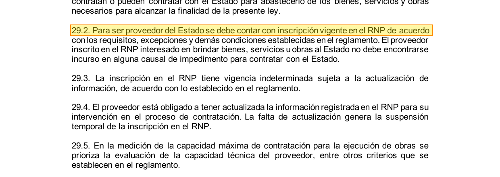

- [ ] La página es correcta   ·   Comentario: 

**`ds_009_2025_ef` — página 7** · debe verse: Art. 25.1: RUC activo y domicilio habido, sin inhabilitación vigente

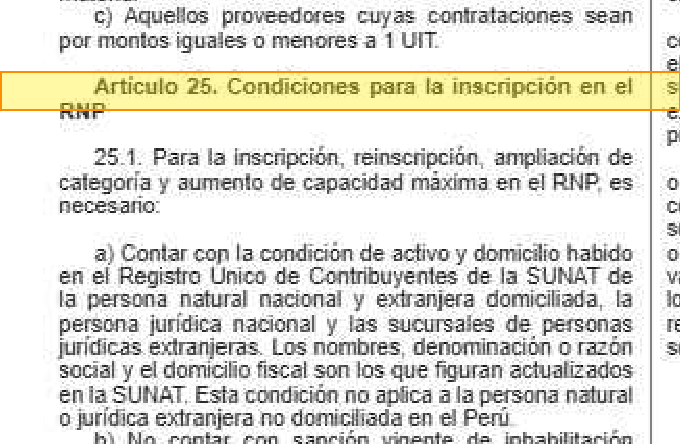

- [ ] La página es correcta   ·   Comentario: 

### q02 · coloquial

**Si la entidad se demora en pagarme, ¿en cuánto tiempo debe pagar y qué me tiene que reconocer por el atraso?**

Esperado: `ley_32069` p. 32

_Ley art. 67.3 (diez días hábiles, prorrogable cinco) y 67.5 (intereses legales por el retraso)._

**`ley_32069` — página 32** · debe verse: Art. 67.3: diez días hábiles (prorrogable cinco); 67.5: intereses legales

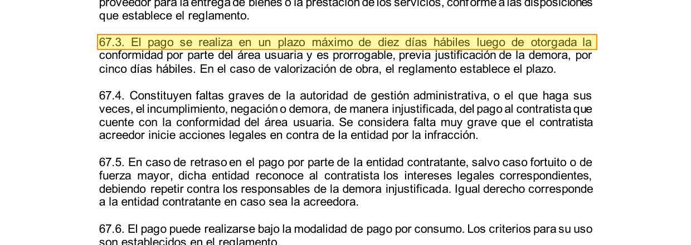

- [ ] La página es correcta   ·   Comentario: 

### q03 · coloquial

**Soy microempresa: ¿puedo cobrar con una factura negociable a plazo cuando le vendo al Estado?**

Esperado: `ley_32069` p. 32

_Ley art. 67.7: facturas negociables por plazos diferidos de hasta 180 días. Misma página que q02 pero otro pasaje._

**`ley_32069` — página 32** · debe verse: Art. 67.7: facturas negociables a plazo de hasta ciento ochenta días

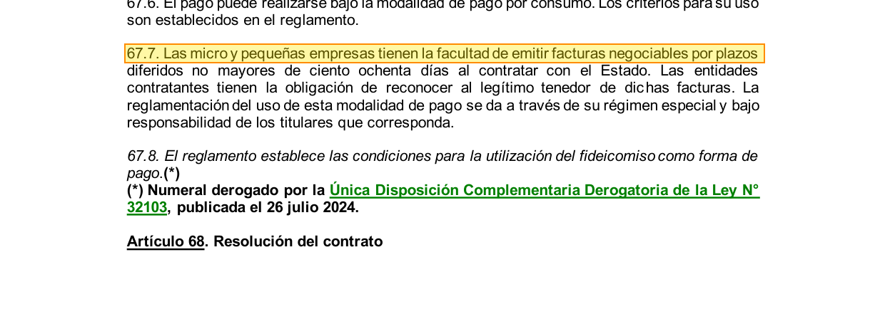

- [ ] La página es correcta   ·   Comentario: 

### q04 · coloquial

**¿Hasta qué monto me pueden comprar sin hacer una licitación o un concurso?**

Esperado: `ley_32069` p. 19

_Ley art. 34.1: contratos menores, hasta 8 UIT, sin procedimiento de selección._

**`ley_32069` — página 19** · debe verse: Art. 34.1: iguales o inferiores a ocho UIT, sin procedimiento de selección

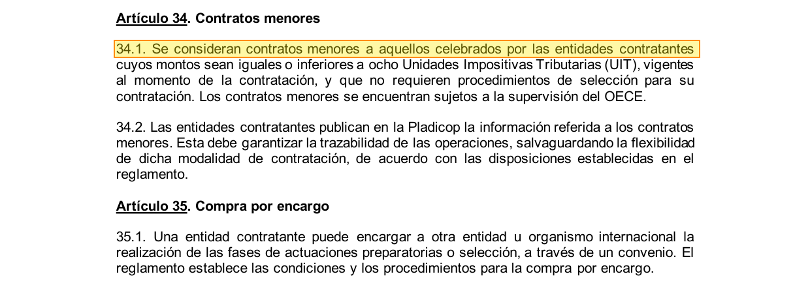

- [ ] La página es correcta   ·   Comentario: 

### q05 · coloquial · **versiones (DS 001-2026-EF)**

**No tengo carta fianza: siendo pequeña empresa, ¿cómo puedo garantizar el cumplimiento del contrato y cómo se aplica esa garantía?**

Esperado: `ds_001_2026_ef` p. 14 · `ds_009_2025_ef` p. 30 · `ley_32069` p. 29

_Versiones: el Reglamento original (art. 114) dice que la MYPE puede usar retención de pago sin importar el monto; el DS 001-2026-EF incorpora el 114.2 con CÓMO se aplica (primera mitad de los pagos, prorrateada). Ley art. 61.3. La respuesta completa exige el DS 001 (primer documento)._

**`ds_001_2026_ef` — página 14** · debe verse: Art. 114.2 (nuevo): retención en la primera mitad de los pagos, prorrateada

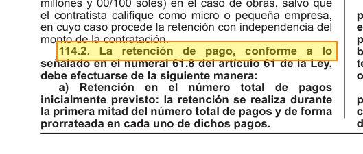

- [ ] La página es correcta   ·   Comentario: 

**`ds_009_2025_ef` — página 30** · debe verse: Art. 114 original: a MYPE le procede la retención con independencia del monto

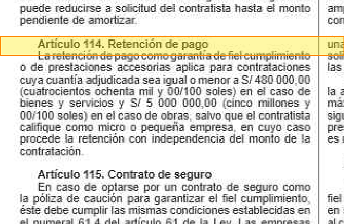

- [ ] La página es correcta   ·   Comentario: 

**`ley_32069` — página 29** · debe verse: Art. 61.3: la MYPE puede dar como garantía la retención de pago

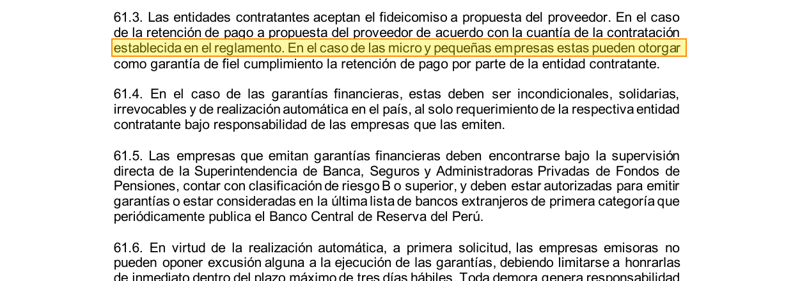

- [ ] La página es correcta   ·   Comentario: 

### q06 · coloquial

**¿Puedo pedir un adelanto para empezar a trabajar y de cuánto?**

Esperado: `ley_32069` p. 32 · `ds_009_2025_ef` p. 34

_Ley art. 66.3: adelantos directos hasta 30 % del monto original; Reglamento art. 137.1: solo en bienes de alta complejidad, servicios especializados u otros por condiciones de mercado._

**`ley_32069` — página 32** · debe verse: Art. 66.3: adelantos directos, en conjunto hasta 30 % del monto original

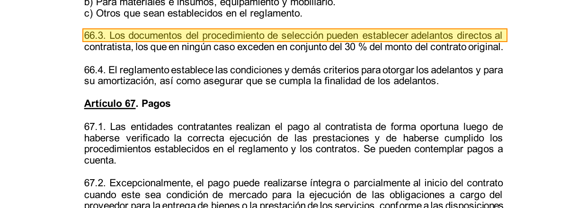

- [ ] La página es correcta   ·   Comentario: 

**`ds_009_2025_ef` — página 34** · debe verse: Art. 137.1: solo bienes de alta complejidad, servicios especializados u otros por condiciones de mercado

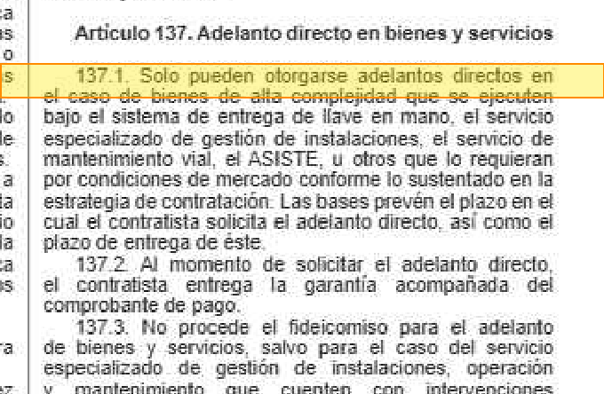

- [ ] La página es correcta   ·   Comentario: 

### q07 · coloquial

**Si dos empresas presentan ofertas con el mismo puntaje, ¿quién se lleva el contrato?**

Esperado: `ds_009_2025_ef` p. 19

_Reglamento art. 81 (criterios de desempate en orden: mejor puntaje técnico, MYPE con personas con discapacidad, MYPE, sorteo). El art. 82 de la misma página sí está modificado, pero no afecta esta respuesta._

**`ds_009_2025_ef` — página 19** · debe verse: Art. 81: orden de desempate (puntaje técnico, MYPE con discapacidad, MYPE, sorteo)

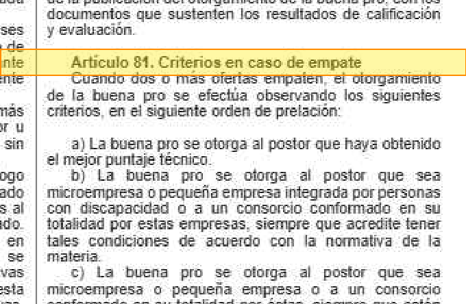

- [ ] La página es correcta   ·   Comentario: 

### q08 · coloquial

**Me descalificaron y quiero reclamar: siendo microempresa, ¿me cobran algo por presentar el recurso?**

Esperado: `ley_32069` p. 36 · `ds_009_2025_ef` p. 68

_Ley art. 73.2: para MYPE la garantía es del 0,5 % de la cuantía con tope de 25 UIT, tanto en el texto en cursiva como en la nota (*) que lo modifica (Ley 32187, vigente desde 2025), que sube la regla general a 3 %. Reglamento art. 309.2: MYPE 0,5 % con límite de 25 UIT. Ojo: esa misma página de la Ley contiene DOS versiones del 73.2 (texto superado + nota con el texto vigente)._

**`ley_32069` — página 36** · debe verse: Art. 73.2: MYPE, garantía del 0,5 % con tope de 25 UIT; la nota (*) trae el texto vigente (Ley 32187: 3 % en general)

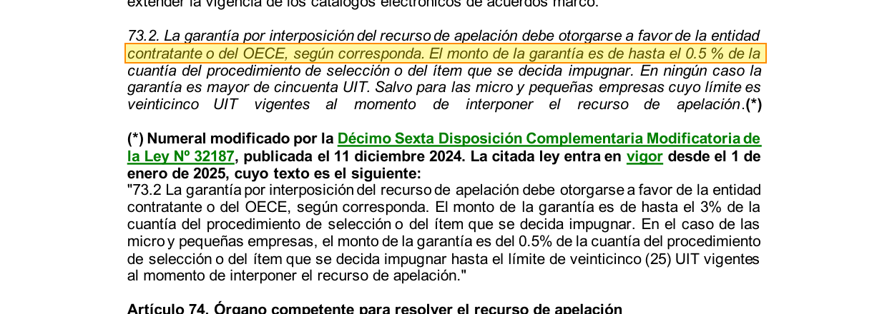

- [ ] La página es correcta   ·   Comentario: 

**`ds_009_2025_ef` — página 68** · debe verse: Art. 309.2: MYPE, garantía del 0,5 % de la cuantía

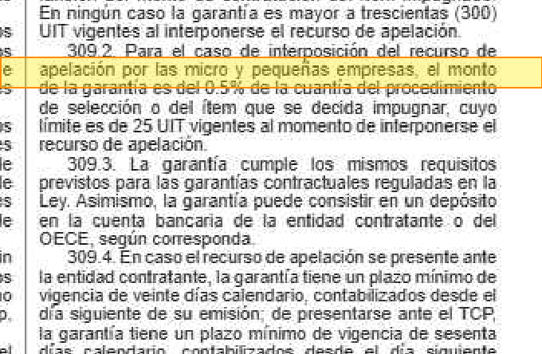

- [ ] La página es correcta   ·   Comentario: 

### q09 · coloquial

**Si cometo una infracción, ¿la multa es menor por ser micro o pequeña empresa?**

Esperado: `ley_32069` p. 45

_Ley art. 89.3: la multa a una MYPE no puede pasar del 8 % de la oferta o del contrato (u 8 UIT si no hay monto). El encabezado del art. 89 está al final de la p. 44; el contenido, en la 45._

**`ley_32069` — página 45** · debe verse: Art. 89.3: multa a MYPE no mayor al 8 % (u 8 UIT sin monto)

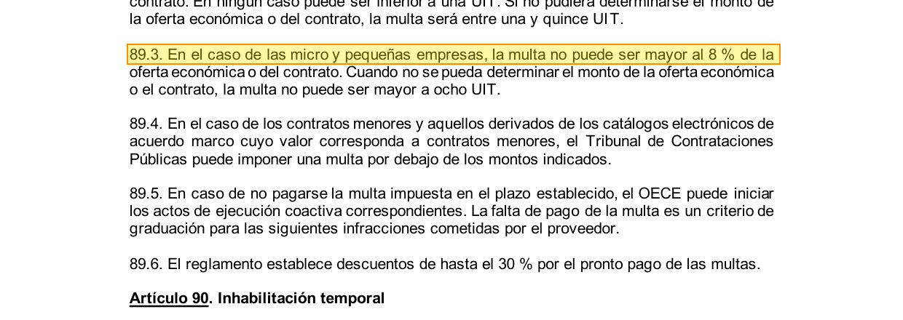

- [ ] La página es correcta   ·   Comentario: 

### q10 · coloquial

**¿Cuánto me pueden cobrar por cada día que entrego tarde?**

Esperado: `ds_009_2025_ef` p. 31

_Reglamento art. 120: penalidad diaria = 0,10 × monto / (F × plazo), con F = 0,40 para bienes y servicios._

**`ds_009_2025_ef` — página 31** · debe verse: Art. 120.1: penalidad diaria = 0,10 × monto / (F × plazo); F = 0,40 en bienes y servicios

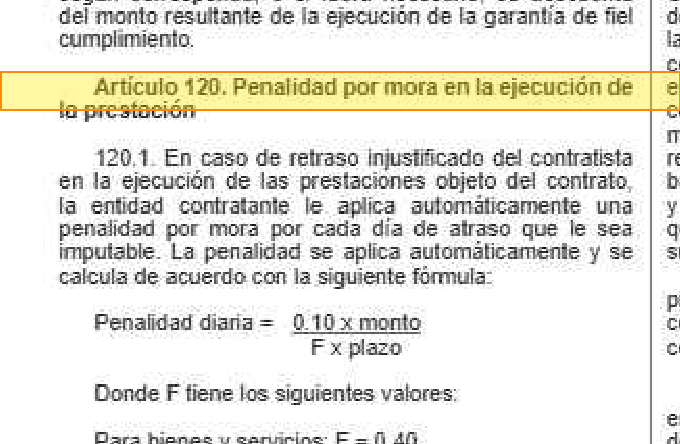

- [ ] La página es correcta   ·   Comentario: 

### q11 · coloquial · **versiones (DS 001-2026-EF)**

**¿Qué tanto pesa el precio al calificar las ofertas? ¿Cuántos puntos puede valer como máximo?**

Esperado: `ds_001_2026_ef` p. 4 · `ds_009_2025_ef` p. 18

_Versiones: el original del art. 75.1 fija 40 puntos «con excepción de la comparación de precios»; el DS 001-2026-EF reescribe el numeral y agrega hasta 70 puntos en licitación pública abreviada de bienes homologados._

**`ds_001_2026_ef` — página 4** · debe verse: Art. 75.1 (nuevo): 40 puntos y hasta 70 en licitación pública abreviada de bienes homologados

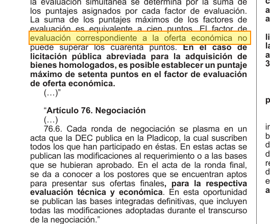

- [ ] La página es correcta   ·   Comentario: 

**`ds_009_2025_ef` — página 18** · debe verse: Art. 75.1 original: 40 puntos «con excepción de la comparación de precios»

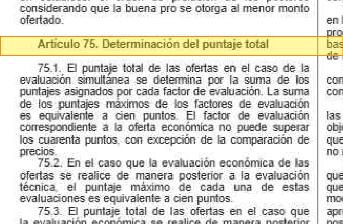

- [ ] La página es correcta   ·   Comentario: 

### q12 · juridico

**¿Hasta qué porcentaje del monto del contrato original pueden aprobarse prestaciones adicionales en bienes y servicios?**

Esperado: `ley_32069` p. 30

_Ley art. 64.1: hasta 25 %. La continuación de la frase y el 64.2 (obras de solo construcción, 15 %) están en la p. 31; aquí se pide solo el 25 %, que está en la p. 30._

**`ley_32069` — página 30** · debe verse: Art. 64.1: prestaciones adicionales hasta por el 25 % del monto del contrato original

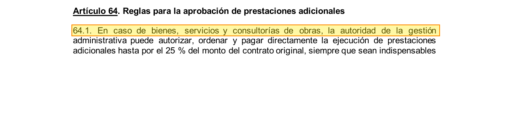

- [ ] La página es correcta   ·   Comentario: 

### q13 · juridico

**¿Dentro de qué plazo debe interponerse el recurso de apelación contra el otorgamiento de la buena pro en un procedimiento de selección competitivo?**

Esperado: `ds_009_2025_ef` p. 67

_Reglamento art. 304.1: ocho días hábiles (304.2: cinco en los procedimientos abreviados). La Ley art. 73 dice cuándo procede el recurso, no el plazo en días._

**`ds_009_2025_ef` — página 67** · debe verse: Art. 304.1: ocho días hábiles siguientes a la notificación de la buena pro

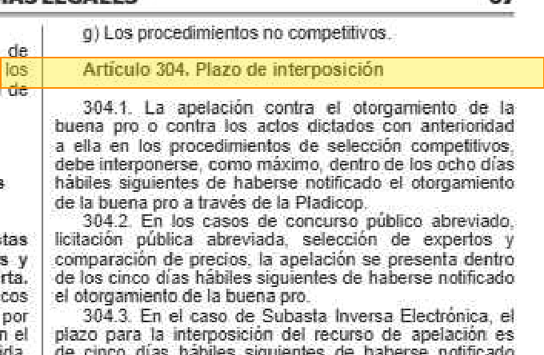

- [ ] La página es correcta   ·   Comentario: 

### q14 · juridico

**¿A los cuántos años prescriben las infracciones administrativas previstas en la Ley?**

Esperado: `ley_32069` p. 47

_Ley art. 93.1: cuatro años (93.2: siete para la infracción del literal m). El encabezado del art. 93 está al final de la p. 46; el contenido, en la 47._

**`ley_32069` — página 47** · debe verse: Art. 93.1: prescriben a los cuatro años de cometida la infracción

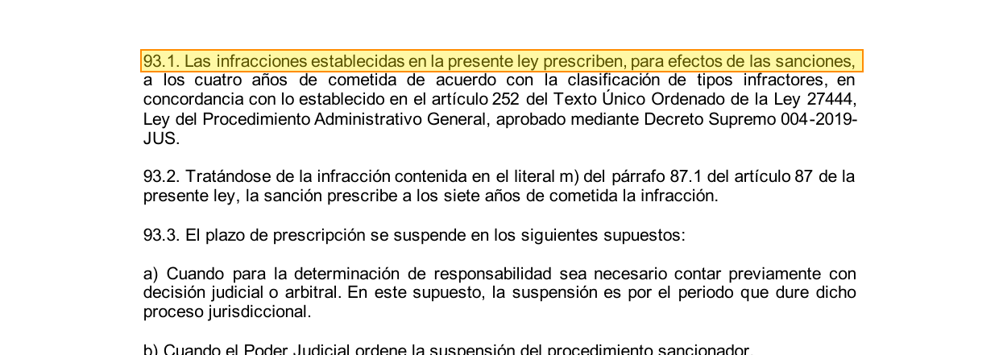

- [ ] La página es correcta   ·   Comentario: 

### q15 · juridico

**¿Cuánto puede durar la inhabilitación temporal para contratar con el Estado?**

Esperado: `ley_32069` p. 45

_Ley art. 90.1: de 3 a 12 meses (literales a-e), de 6 a 18 meses (f-h; 12 a 24 si hay reincidencia) o de 6 a 24 meses (i-l)._

**`ley_32069` — página 45** · debe verse: Art. 90.1: 3 a 12 meses (a-e); 6 a 18 (f-h); 6 a 24 (i-l)

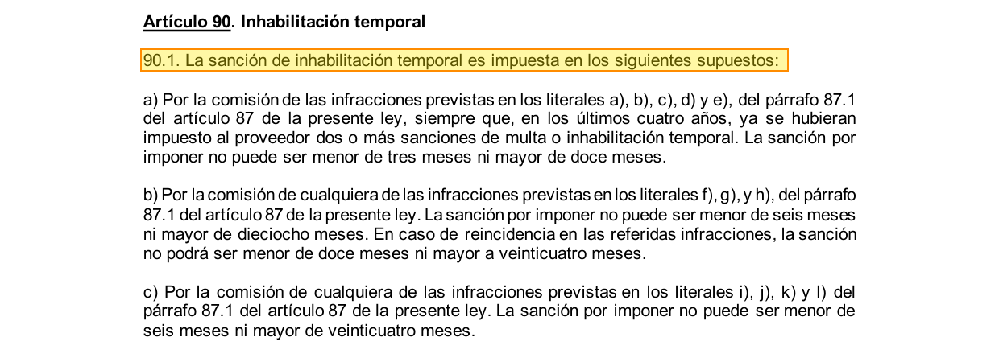

- [ ] La página es correcta   ·   Comentario: 

### q16 · juridico

**¿Se realiza evaluación técnica de las ofertas en la subasta inversa electrónica?**

Esperado: `ds_009_2025_ef` p. 26

_Reglamento art. 96.3: no se realiza evaluación técnica; la revisión de requisitos de calificación va después de la evaluación económica. El art. 96 tiene el numeral 96.5 modificado, que no cambia esta respuesta._

**`ds_009_2025_ef` — página 26** · debe verse: Art. 96.3: no se realiza evaluación técnica; los requisitos de calificación se revisan después de la evaluación económica

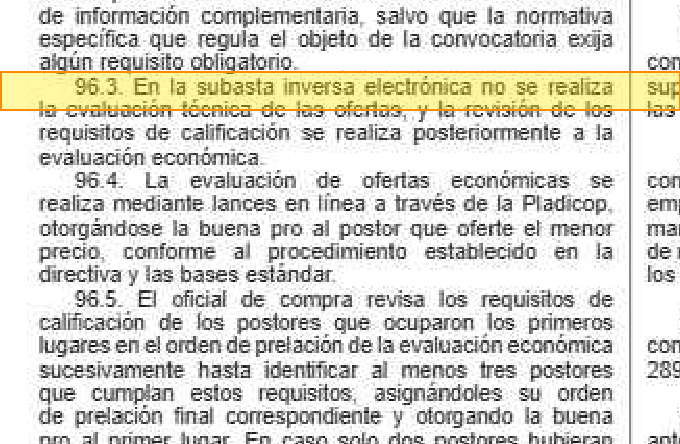

- [ ] La página es correcta   ·   Comentario: 

### q17 · juridico

**¿Qué valor legal tienen los actos y procedimientos que se realizan a través de la Pladicop?**

Esperado: `ds_009_2025_ef` p. 60

_Reglamento art. 257.1: tienen la misma validez y eficacia que los realizados por medios físicos tradicionales._

**`ds_009_2025_ef` — página 60** · debe verse: Art. 257.1: misma validez y eficacia que los medios físicos tradicionales

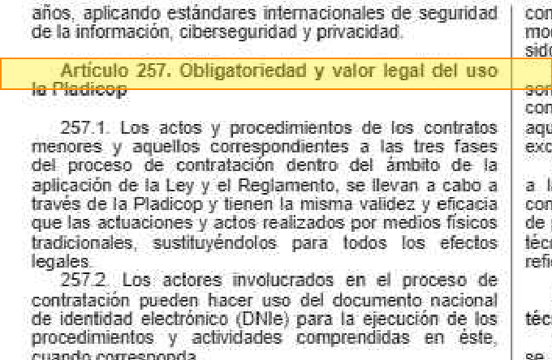

- [ ] La página es correcta   ·   Comentario: 

### q18 · juridico · **versiones (DS 001-2026-EF)**

**¿Quién revisa los requisitos de calificación cuando la evaluación de ofertas la hace un jurado?**

Esperado: `ds_001_2026_ef` p. 4 · `ds_009_2025_ef` p. 17

_Versiones: el original del art. 72.2 solo dice que los evaluadores los revisan; el DS 001-2026-EF agrega que, con jurados, los revisa la DEC (que puede pedir opinión al jurado)._

**`ds_001_2026_ef` — página 4** · debe verse: Art. 72.2 (nuevo): con jurados, los revisa la DEC, que puede pedir opinión al jurado

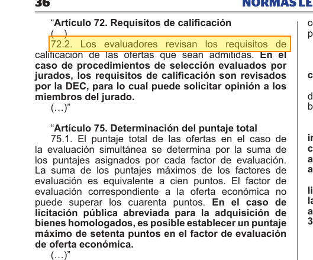

- [ ] La página es correcta   ·   Comentario: 

**`ds_009_2025_ef` — página 17** · debe verse: Art. 72.2 original: solo «los evaluadores revisan los requisitos de calificación»

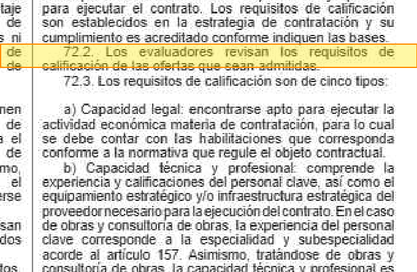

- [ ] La página es correcta   ·   Comentario: 

### q19 · juridico · **versiones (DS 001-2026-EF)**

**¿Se pueden aprobar prestaciones adicionales de obra en vía de regularización?**

Esperado: `ds_001_2026_ef` p. 8, 9 · `ds_009_2025_ef` p. 47

_Versiones: el DS 001-2026-EF (arts. 194 y 195) prohíbe aprobar prestaciones adicionales de obra en vía de regularización; el original (art. 194.1-194.2) habla de su regularización._

**`ds_001_2026_ef` — página 8** · debe verse: Art. 194 (nuevo): prohibida la aprobación en vía de regularización

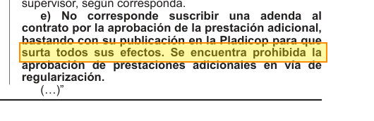

- [ ] La página es correcta   ·   Comentario: 

**`ds_001_2026_ef` — página 9** · debe verse: Art. 195 (nuevo): misma prohibición

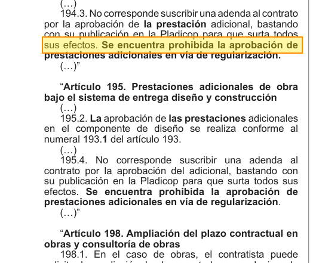

- [ ] La página es correcta   ·   Comentario: 

**`ds_009_2025_ef` — página 47** · debe verse: Art. 194.1 original: regularización según el procedimiento del 194.2

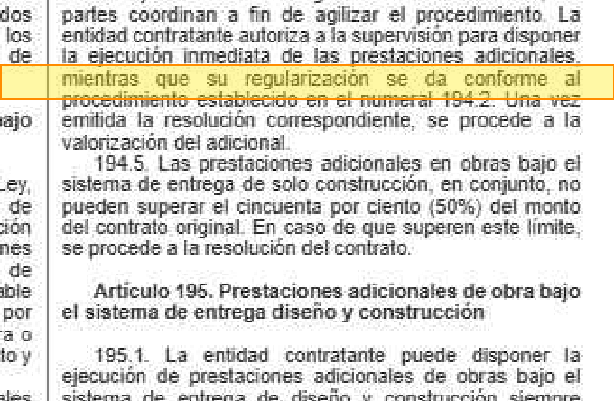

- [ ] La página es correcta   ·   Comentario: 

### q20 · juridico · **versiones (DS 001-2026-EF)**

**¿Les son aplicables a los contratos menores las causales de nulidad del contrato previstas en la Ley?**

Esperado: `ds_001_2026_ef` p. 15 · `ds_009_2025_ef` p. 55 · `ley_32069` p. 35

_Versiones: el DS 001-2026-EF incorpora el numeral 229.5 (aplican las causales del 71.1 de la Ley); el original del art. 229 no lo decía. Ley art. 71.1 en la p. 35._

**`ds_001_2026_ef` — página 15** · debe verse: Art. 229.5 (nuevo): aplican las causales de nulidad del 71.1 de la Ley

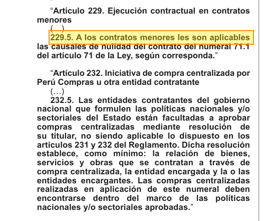

- [ ] La página es correcta   ·   Comentario: 

**`ds_009_2025_ef` — página 55** · debe verse: Art. 229 original (sin el numeral 229.5)

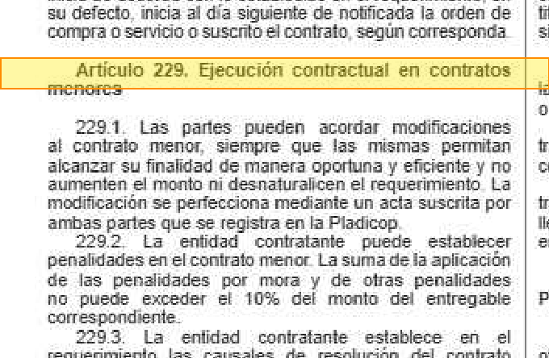

- [ ] La página es correcta   ·   Comentario: 

**`ley_32069` — página 35** · debe verse: Art. 71.1: causales de nulidad del contrato

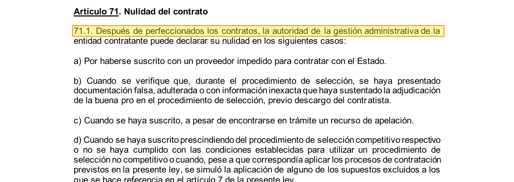

- [ ] La página es correcta   ·   Comentario: 

### q21 · juridico

**¿Qué funciones tiene la junta de prevención y resolución de disputas?**

Esperado: `ley_32069` p. 39 · `ds_009_2025_ef` p. 76

_Ley art. 79.2 (absolver consultas y resolver controversias técnicas y contractuales) y Reglamento art. 350 (funciones)._

**`ley_32069` — página 39** · debe verse: Art. 79.2: absolver consultas y resolver controversias técnicas y contractuales

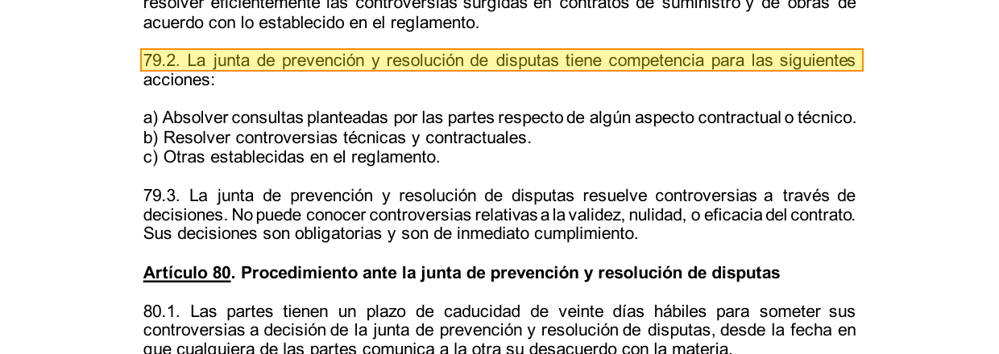

- [ ] La página es correcta   ·   Comentario: 

**`ds_009_2025_ef` — página 76** · debe verse: Art. 350: funciones de la JPRD

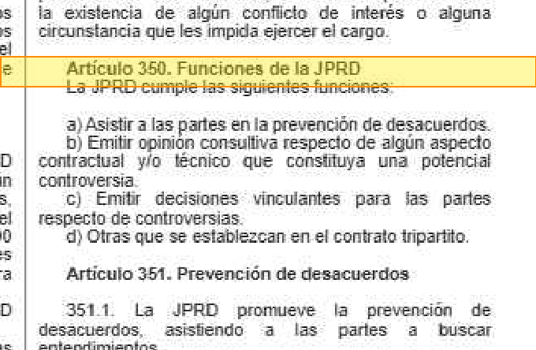

- [ ] La página es correcta   ·   Comentario: 

## Preguntas fuera del dominio

Para cada una hay que confirmar que **el corpus indexado no la responde**. Las cercanas al dominio (o02, o03, o05, o06) son las que ponen a prueba el umbral.

### o01 · coloquial

**¿Cómo declaro en la SUNAT el IGV de las facturas que le emito al Estado?**

_Tributación: cercana al dominio (el corpus menciona el IGV solo como parte de la oferta económica) pero no explica cómo declararlo._

- [ ] Confirmo que el corpus indexado no la responde   ·   Comentario: 

### o02 · coloquial

**¿Qué penalidad puedo cobrarle a un proveedor privado que le entrega tarde un pedido a mi empresa?**

_Contratación entre privados: muy cercana a q10 (penalidad por mora), pero la norma indexada regula contratos con el Estado. Es la pregunta más difícil para el umbral de similitud._

- [ ] Confirmo que el corpus indexado no la responde   ·   Comentario: 

### o03 · juridico

**¿Cuál es el plazo para impugnar una licitación pública en Colombia?**

_Normativa de otro país: cercana (impugnación de licitaciones, como q13) pero fuera de la normativa peruana indexada._

- [ ] Confirmo que el corpus indexado no la responde   ·   Comentario: 

### o04 · coloquial

**¿Cómo se prepara un buen ceviche?**

_Obviamente ajena al dominio. Los modelos multilingües suelen dar similitudes altas para esta clase de preguntas (el issue reporta 0,79)._

- [ ] Confirmo que el corpus indexado no la responde   ·   Comentario: 

### o05 · juridico

**¿Cómo se calcula la capacidad máxima de contratación de un ejecutor de obras?**

_Solo la responde el art. 28 del Reglamento (p. 8 del PDF), que NO está en el subconjunto de OCR. El corpus menciona el concepto en muchas páginas (Ley art. 29.5, Reglamento arts. 25 y 29, disposiciones transitorias) pero no la fórmula: el sistema debe decir que no la tiene._

La respuesta está en `ds_009_2025_ef` p. 8, **excluida del índice**: Art. 28.1: fórmula CMC = Σ obras culminadas × G. Página EXCLUIDA del subconjunto de OCR

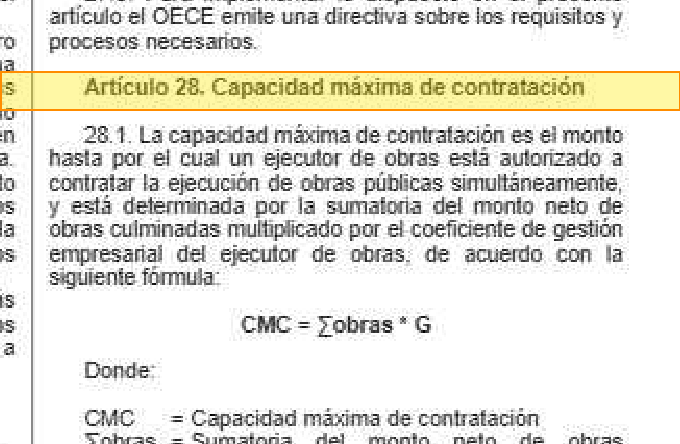

- [ ] Confirmo que el corpus indexado no la responde   ·   Comentario: 

### o06 · coloquial

**¿A cuántos soles equivalen 8 UIT este año?**

_El corpus usa la UIT como unidad (q04) pero no fija su valor en soles, que lo establece un decreto aparte._

- [ ] Confirmo que el corpus indexado no la responde   ·   Comentario: 
