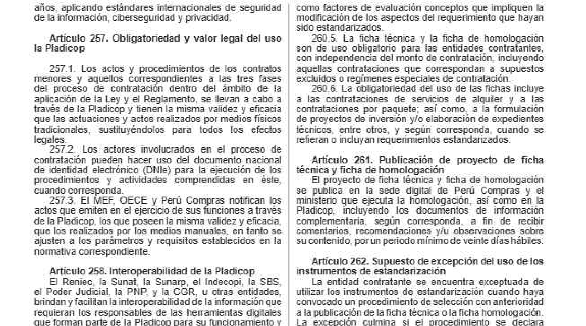
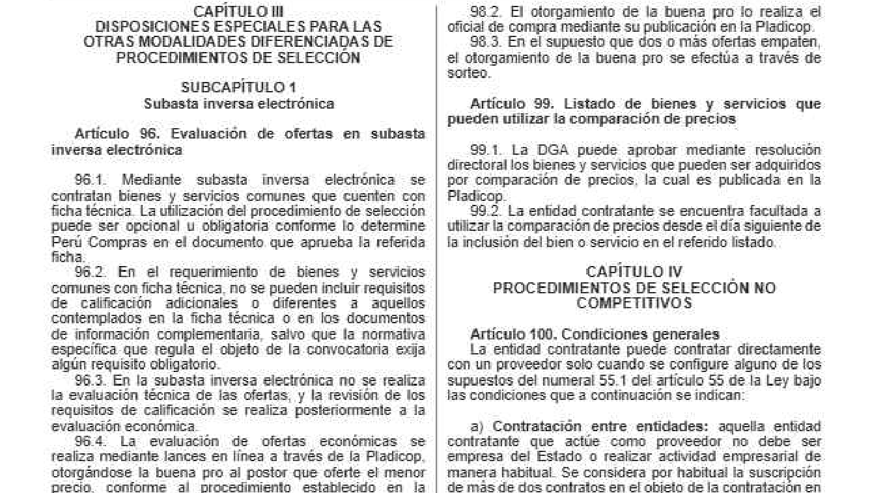
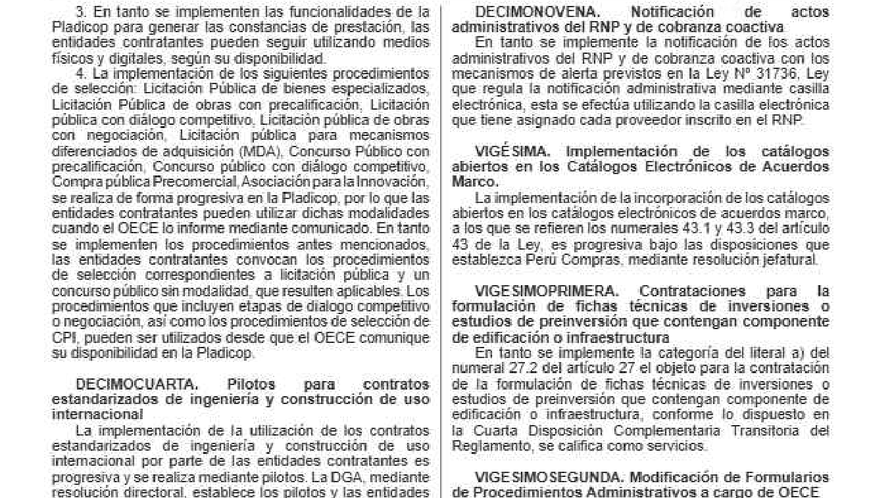

# Verificación del orden de lectura del OCR

Documento: **Decreto Supremo N.° 009-2025-EF, Reglamento de la Ley N.° 32069** · OCR: tesseract a 200 DPI · páginas de dos columnas, revisadas: p60, p26, p100.

Cada bloque muestra el **recorte de la imagen original** y, debajo, las líneas extraídas **en el orden en que las entrega el OCR**, etiquetadas `[I]` (columna izquierda) o `[D]` (derecha). Si el orden fuera correcto, todas las `[I]` de la parte superior aparecerían seguidas y luego las `[D]`. El indicador **saltos de columna** cuenta los cambios I↔D en toda la página: **1 = bien leída** (baja por la izquierda y luego por la derecha); muchos saltos = columnas mezcladas.

## Resultado automático

| Página | Saltos de columna | Líneas | Lectura |
|---:|---:|---:|---|
| 60 | 1 | 147 | correcta (columnas en orden) |
| 26 | 1 | 143 | correcta (columnas en orden) |
| 100 | 1 | 143 | correcta (columnas en orden) |

## Página 60

Saltos de columna en toda la página: **1** (147 líneas) · confianza del motor 89.9.



Líneas extraídas del recorte (de 10% a 45% de la altura), en orden de salida del OCR:

```text
[I] años, aplicando estándares internacionales de seguridad
[I] de la información, ciberseguridad y privacidad.
[I] Articulo 257. Obligatoriedad y valor legal del uso
[I] la Pladicop
[I] 257.1 Los actos y procedimientos de los contratos
[I] menores y aquellos € ondientes a las tres fases
[I] del proceso de contratación dentro del ambito de la
[I] aplicación de la Ley y el Reglamento, se llevan a cabo a
[I] través de la Pladicop y tienen la misma validez y eficacia
[I] que las actuaciones y actos realizados por medios fisicos
[I] tradicionales, sustituyéndolos para todos los efectos
[I] legales.
[I] 2572. Los actores mvolucrados en el proceso de
[I] contratación pueden hacer uso del documento nacional
[I] de identidad electrónico (Dile; para la ejecución de los
[I] procedimientos y actividades comprendidas en éste.
[I] cuando corresponda.
[I] 2573. El MEF, OECE y Perú Compras notifican los
[I] actos que emiten en el ejercicio de sus funciones a través
[I] de la Pladicop, los que poseen la misma validez y eficacia,
[I] que los realizados por los medios manuales, en tanto se
[I] ajusien a los parámetros y requisitos establecidos en la
[I] normativa correspondiente.
[I] Articulo 258. Interoperabilidad de la Pladicop
[I] El Reniec, la Sunal, la Sunarp, el Indecopi, la SES,
[I] el Poder Judicial, la PNP, y la CGR, u otras entidades,
[I] brindan y facilitan la interoperabilidad de la información que:
[I] requieran los responsables de las herramientas digitales
[I] que forman parte de la Pladicop para su funcionamiento y
[D] como factores de evaluación conceptos que impliquen la
[D] modificación de los aspectos del requerimiento que hayan
[D] sido estandarizados
[D] 260.5. La ficha técnica y la ficha de homologación
[D] son de uso obligatorio para las entidades contratantes,
[D] con independencia del monto de contratación. incluyendo
[D] aquellas contrataciones que correspondan a supuestos
[D] excluidos o regimenes especiales de contratación
[D] 260.6. La obligatoriedad del uso de las fichas incluye
[D] a las contrataciones de servicios de alquiler y a las
[D] contrataciones por paquete; asÍ como, a la formulación
```

## Página 26

Saltos de columna en toda la página: **1** (143 líneas) · confianza del motor 89.4.



Líneas extraídas del recorte (de 10% a 45% de la altura), en orden de salida del OCR:

```text
[I] CAPITULO 111
[I] DISPOSICIONES ESPECIALES PARA LAS
[I] OTRAS MODALIDADES DIFERENCIADAS DE
[I] PROCEDIMIENTOS DE SELECCION
[I] SUBCAPÍTULO 1
[I] Subasta inversa electrónica
[I] Articulo 96. Evaluación de ofertas en subasta
[I] inversa electrónica
[I] 96.1 Mediante subasta inversa electrónica se
[I] contralan bienes y servicios comunes que cuenten: con
[I] ficha técnica. La utilización del procedimiento de selección
[I] puede ser opcional u obligatoria conforme lo determine
[I] Perú Compras en el documento que aprueba la referida
[I] ficha.
[I] 96.2. En el requerimiento de bienes y servicios
[I] comunes con ficha técnica, no se pueden incluir requisitos
[I] de calificación adicionales o diferentes a aquellos
[I] contemplados en la ficha técnica o en los documentos
[I] de información complementaria, salvo que la normativa
[I] especifica que regula el objeto de la. convocatoria exija
[I] algún requisito obligatorio.
[I] 96.3. En la subasta inversa electrónica no se realiza
[I] la evaluación técnica de las oferlas, y la revisión de los
[I] requisitos de calificación se realiza posteriormente a la
[I] evaluación económica.
[I] 964 La evaluación de ofertas económicas se
[I] realiza mediante lances en linea a través de la Pladicop,
[I] otorgándose la buena pro al postor que oferte el menor
[I] precio, conforme al procedimiento establecido en la
[D] 598.2. El otorgamiento de la buena pro lo realiza el
[D] oficial de compra mediante su publicación en la Pladicop
[D] 98.3. En el supuesto que dos o más ofertas empaten,
[D] el otorgamiento de la buena pro se efectúa a través de
[D] sorieo.
[D] Artículo 399. Listado de bienes y servicios que
[D] pueden utilizar la comparación de precios
[D] 99.1. La DGA puede aprobar mediante resolución
[D] directoral los bienes y servicios que pueden ser adquiridos
[D] por comparación de precios, la cual es publicada en la
[D] Pladicop.
```

## Página 100

Saltos de columna en toda la página: **1** (143 líneas) · confianza del motor 88.7.



Líneas extraídas del recorte (de 10% a 45% de la altura), en orden de salida del OCR:

```text
[I] 3. En tanto se implementen las funcionalidades de la
[I] Pladicop para generar las constancias de prestación, las
[I] entidades contratantes pueden seguir ufilizando medios
[I] físicos y digitales, según su disponibilidad.
[I] 4. La implementación de los siguientes procedimientos
[I] de selección: Licitación Pública de bienes especializados,
[I] Licitación Pública de obras con precalificación, Licitación
[I] pública con dialogo compeiilivo. Licitación pública de obras
[I] con megociación, Licitación pública para mecanismos
[I] diferenciados de adquisición (MIDA), Concurso Público con
[I] precalificación Concurso público con diálogo competitivo
[I] Compra pública Precomercial, Asociación para la Innovación,
[I] se realiza de forma progresiva en la Pladicop, por lo que las
[I] entidades contratantes pueden utilizar dichas modalidades
[I] cuando el OECE lo informe mediante comunicado. En tanto
[I] se implementen los procedimientos antes mencionados,
[I] las entidades contratantes convocan los procedimientos
[I] de selección comespondientes a licitación pública y un
[I] concurso público sin modalidad. que resulten aplicables Los
[I] procedimientos que incluyen etapas de dialogo competitivo
[I] o negociación, asi como los procedimientos de selección de
[I] (CPI, pueden ser ufilizados desde que el DEGE comunique:
[I] su disponibilidad en la Pladicop.
[I] DECIMOCUARTA. — Pilotos para contratos
[I] estandarizados de ingeniería y construcción de uso
[I] internacional
[I] La implementación de la utilización de los contratos
[I] estandarizados de ingeniería y construcción de uso
[I] intemacional por parte de las entidades contratantes es
[I] progresiva y se realiza mediante pilotos. La DGA, mediante
[I] resolución directoral, esilablece los pilotos y las entidades
[D] DECIMONOVENA. Notificación — de
[D] administrativos del RNP y de cobranza coactiva
[D] En tanto se implemente la nolificación de tos. actos
[D] administrativos del RNP y de cobranza coactiva con los
[D] mecanismos de alerla previstos en la Ley N* 31736, Ley
[D] que regula la notificación administrativa mediante casilla
[D] electrónica, esta se efectúa utilizando la casilla electrónica
[D] que tiene asignado cada proveedor inscrito en el RNP
[D] actos
```

## Revisión visual

_Hecha por el asistente comparando cada recorte con su texto extraído (21-sep-2026). **Pendiente la confirmación de la persona `[MANUAL]`.**_

| Página | Tipo de diseño | Orden de lectura | Hallazgo |
|---:|---|---|---|
| 60 | Dos columnas, artículos 257–265 | ✅ correcto | Baja por la izquierda y la columna derecha arranca en «como factores de evaluación…», igual que en la imagen. |
| 26 | Dos columnas con **encabezados a media página**: CAPÍTULO III y SUBCAPÍTULO 1 arriba a la izquierda, CAPÍTULO IV a media altura de la columna derecha | ✅ correcto | Secuencia `I×69 → D×68`: no se intercalan columnas y el CAPÍTULO IV (centrado, dentro de la columna derecha) queda en su lugar, antes del artículo 100. |
| 100 | Dos columnas con lista numerada y títulos justificados (Disposiciones Complementarias Transitorias) | ✅ correcto, con **un desorden local** | En el título justificado «DECIMONOVENA. Notificación **de actos** administrativos…», el espaciado grande hizo que la palabra «actos» saliera como una línea suelta al final de la columna. |

### Hallazgos

1. **No hay columnas mezcladas.** Tesseract (`--psm 3`) detecta el diseño de dos columnas; en las tres páginas el orden salta una sola vez de la columna izquierda a la derecha. **Se acepta**, sin corrección.
2. **Desorden local en títulos justificados** (p. 100): una palabra puede separarse de su línea. Impacto bajo: afecta a una palabra de un título, no cambia el orden de los párrafos. **Se acepta** y se declara como limitación.
3. **El problema real no es el orden sino los errores de carácter**, causados por el escaneo de 96 DPI. Ejemplos vistos en estas tres páginas: `Articulo 399` por `Artículo 99`, `598.2` por `98.2`, `964` por `96.4`, `CAPITULO 111` por `CAPÍTULO III`, `contralan` por `contratan`, `oferlas` por `ofertas`, `sorieo` por `sorteo`, `megociación` por `negociación`, `DEGE` por `OECE`, `MIDA` por `MDA`, `€ ondientes` por `correspondientes`.
   - **Consecuencia para las fases siguientes:** un número de artículo mal leído (`399`) generaría un artículo inexistente en los metadatos. La extracción de `articulos_mencionados` (Fase 4) debe **descartar los números fuera del rango real del Reglamento (1–389)** y debe apoyarse en el rango de artículos de la página.
   - Las preguntas de evaluación deben usar términos que resistan estos errores; y las citas siempre llevan la página, que no depende del OCR.
