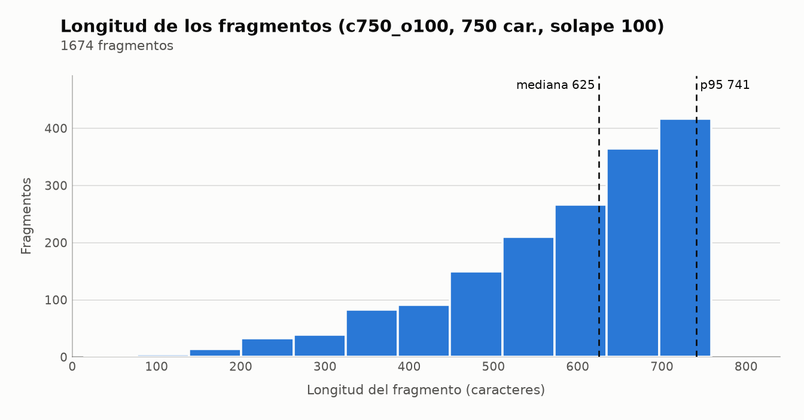

# Reporte del índice

Troceado `c750_o100` (750 caracteres, solape 100, contexto de encabezado: sí) · modelo `intfloat/multilingual-e5-small` (longitud máxima de entrada: 512 tokens).

## Fragmentos por documento y longitud (caracteres)

| Documento | Págs. | Fragmentos | De OCR | Mín. | Mediana | p95 | Máx. | Tokens máx. | Truncados |
|---|---|---|---|---|---|---|---|---|---|
| ley_32069 | 63 | 427 | 0 | 15 | 616 | 739 | 749 | 204 | 0 |
| ds_009_2025_ef | 75 | 1042 | 1042 | 114 | 630 | 741 | 750 | 233 | 0 |
| ds_001_2026_ef | 16 | 205 | 0 | 103 | 624 | 745 | 750 | 236 | 0 |
| TOTAL | 154 | 1674 | 1042 | 15 | 625 | 741 | 750 | 236 | 0 |

## Truncamiento: 0 de 1674 fragmentos superan 512 tokens

El fragmento más largo mide 236 tokens (con el prefijo y el encabezado de contexto). Ninguno se trunca en silencio.

## Distribución de longitudes

Tabla equivalente del histograma:

| Longitud (caracteres) | Fragmentos |
|---|---:|
| 15–76 | 1 |
| 77–138 | 5 |
| 139–200 | 14 |
| 201–262 | 33 |
| 263–324 | 39 |
| 325–386 | 83 |
| 387–448 | 91 |
| 449–510 | 150 |
| 511–572 | 210 |
| 573–634 | 266 |
| 635–696 | 365 |
| 697–758 | 417 |
