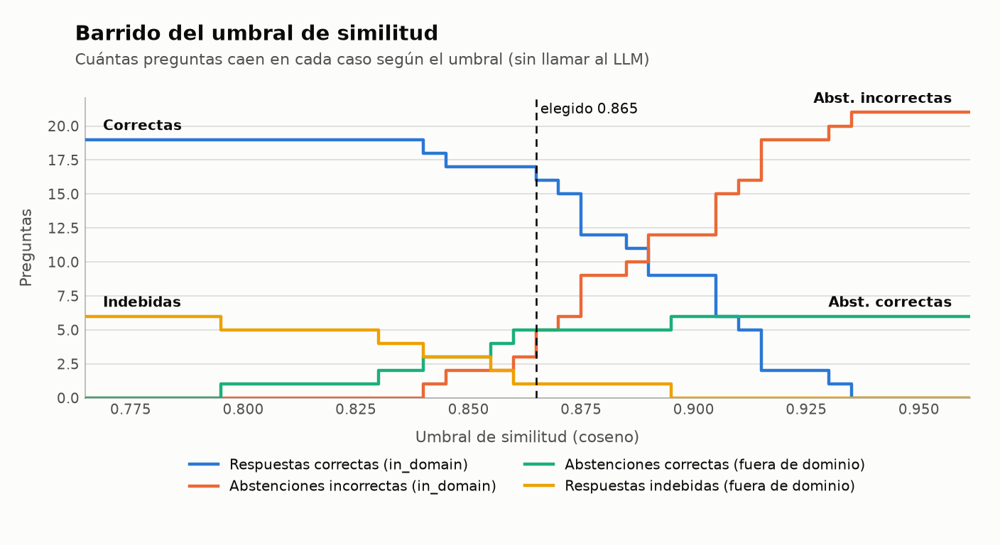

# Calibración del umbral de similitud

> **PROVISIONAL.** Estas métricas dependen de `eval/preguntas.csv`, cuyas páginas esperadas aún no han sido validadas por la persona (Fase 3, punto manual). Se recalculan sin cambios de código cuando `eval.set_validado` pasa a `true`.

Barrido de 0.0 a 1.0 en pasos de 0.005 sobre las 21 preguntas in_domain y las 6 out_of_domain del set de evaluación (recuperación `semantico`, 5 fragmentos, modelo `intfloat/multilingual-e5-small`). Sin llamar al LLM.

## Umbral elegido: **0.865**

Criterio: máximo **F-β con β = 0.5** (la precisión pesa 4 veces lo que la cobertura: responder mal es peor que no responder). Empatan 1 umbrales entre 0.865 y 0.865; se toma el centro de esa meseta. En 0.865: 16 respuestas correctas, 0 erróneas, 5 abstenciones incorrectas, 5 abstenciones correctas y 1 respuestas indebidas (precisión 0.9412, cobertura 0.7619).

## Por qué el margen es estrecho

Los modelos multilingües dan similitudes comprimidas. Aquí las preguntas in_domain tienen mejor similitud entre 0.837 y 0.931 (mediana 0.885) y las out_of_domain entre 0.795 y 0.893 (mediana 0.847). Un umbral «a ojo» (0,78 en el ejemplo del enunciado) no separa nada.

## Gráfico

Solo se dibuja el tramo donde hay preguntas; la tabla completa (0 a 1) está en `umbral_barrido.csv`. Tabla equivalente alrededor del umbral elegido:

| Umbral | Correctas | Erróneas | Abst. incorrectas | Abst. correctas | Indebidas | Precisión | Cobertura | F-β |
|---|---|---|---|---|---|---|---|---|
| 0.850 | 17 | 2 | 2 | 3 | 3 | 0.773 | 0.809 | 0.780 |
| 0.860 | 17 | 1 | 3 | 5 | 1 | 0.895 | 0.809 | 0.876 |
| 0.870 | 15 | 0 | 6 | 5 | 1 | 0.938 | 0.714 | 0.882 |
| 0.880 | 12 | 0 | 9 | 5 | 1 | 0.923 | 0.571 | 0.822 |

## Mejor similitud de cada pregunta (de menor a mayor)

| Id | Tipo | Estilo | Mejor similitud | Acierto en top-5 |
|---|---|---|---|---|
| o04 | out_of_domain | coloquial | 0.7949 |  |
| o06 | out_of_domain | coloquial | 0.8298 |  |
| q10 | in_domain | coloquial | 0.8365 | True |
| o01 | out_of_domain | coloquial | 0.8391 |  |
| q01 | in_domain | coloquial | 0.8429 | True |
| o03 | out_of_domain | juridico | 0.8541 |  |
| o02 | out_of_domain | coloquial | 0.8556 |  |
| q04 | in_domain | coloquial | 0.8564 | False |
| q08 | in_domain | coloquial | 0.8600 | True |
| q07 | in_domain | coloquial | 0.8643 | False |
| q11 | in_domain | coloquial | 0.8691 | True |
| q06 | in_domain | coloquial | 0.8720 | True |
| q15 | in_domain | juridico | 0.8725 | True |
| q02 | in_domain | coloquial | 0.8738 | True |
| q03 | in_domain | coloquial | 0.8800 | True |
| q20 | in_domain | juridico | 0.8850 | True |
| q05 | in_domain | coloquial | 0.8855 | True |
| o05 | out_of_domain | juridico | 0.8934 |  |
| q19 | in_domain | juridico | 0.9002 | True |
| q09 | in_domain | coloquial | 0.9010 | True |
| q17 | in_domain | juridico | 0.9030 | True |
| q14 | in_domain | juridico | 0.9088 | True |
| q21 | in_domain | juridico | 0.9103 | True |
| q12 | in_domain | juridico | 0.9110 | True |
| q18 | in_domain | juridico | 0.9132 | True |
| q13 | in_domain | juridico | 0.9251 | True |
| q16 | in_domain | juridico | 0.9313 | True |

**Limitación:** el umbral se calibra con el mismo set de preguntas con que se evalúa; no se ha probado con preguntas nuevas.
