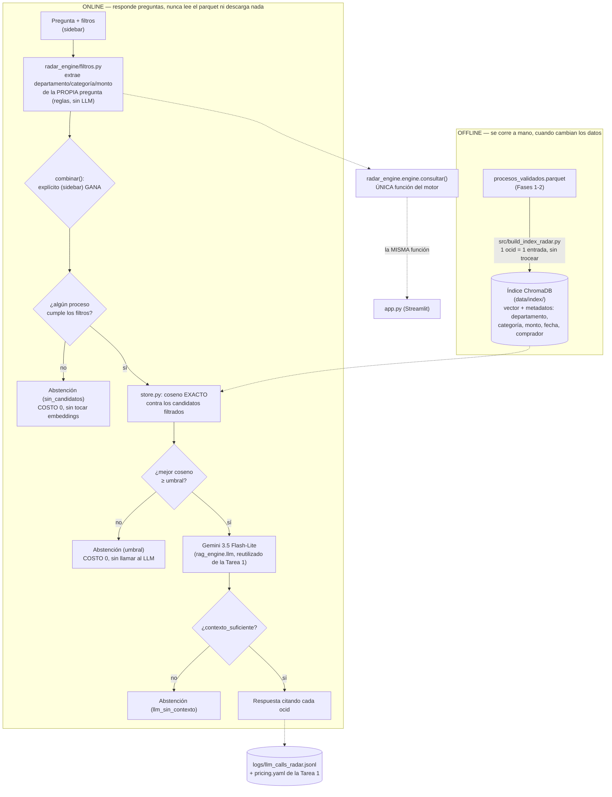
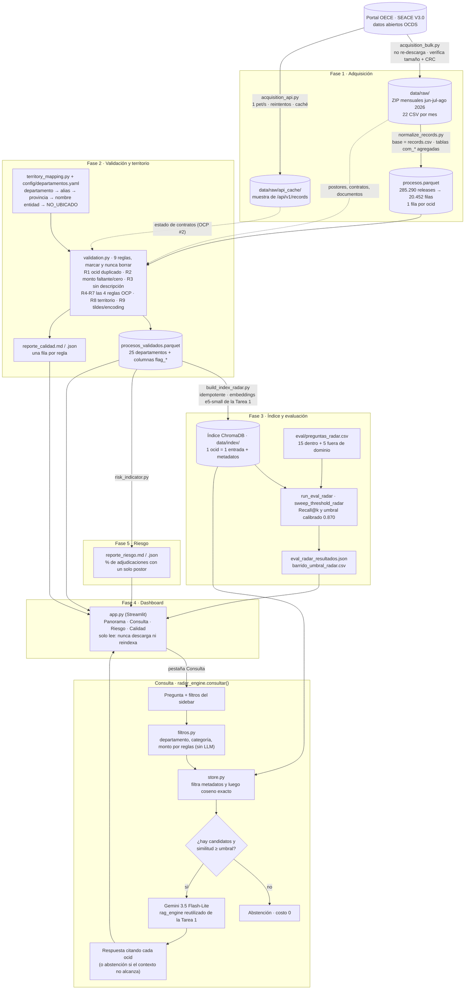

# Tarea 2 — RAG Radar de contrataciones públicas (SEACE V3.0 / OCDS)

Fases 1 (adquisición) y 2 (validación y normalización territorial) sobre datos abiertos de OECE. Fases 3-5:
un motor RAG **híbrido** (filtros estructurados + similitud semántica) sobre `data/processed/procesos_validados.parquet`,
que **reutiliza `rag_engine` de la Tarea 1** (`../Tarea 1/src/rag_engine/`: embeddings, cliente de LLM, log y
tabla de precios — ver `src/radar_engine/bootstrap_t1.py` y la sección "Arquitectura" más abajo), más un
dashboard Streamlit y un indicador de riesgo de postor único.

> **Estado (2026-09-23):** Fases 1-5 implementadas y corridas de punta a punta sobre los datos reales
> (20.452 procesos): índice construido e IDEMPOTENCIA verificada (segunda corrida: 0 nuevos/actualizados),
> umbral calibrado con evidencia (`retrieval.umbral_similitud: 0.870`), `python src/risk_indicator.py`
> ejecutado, **37 pruebas** (`pytest`) en verde, y el dashboard probado de punta a punta con
> `streamlit.testing.v1.AppTest` (sin navegador disponible en este entorno): se encontraron y corrigieron 3
> fallos reales en esa prueba (columna no serializable a Arrow en la tabla "Por pregunta", un desfase de
> fecha por redondeo a medianoche que excluía 1 proceso, y un `ConfigError` de la Tarea 2 que no capturaba el
> `except ConfigError` de la Tarea 1 por ser clases de módulos distintos — quedó documentado en
> `radar_engine/engine.py`). Pendiente [MANUAL]: la persona debe poner su `GEMINI_API_KEY` en `.env` para
> probar la generación real (la recuperación, los filtros y la abstención por umbral no la necesitan) y
> grabar el video.

## Cómo ejecutarlo

```bash
# Python 3.12 (el mismo que la Tarea 1; necesario para las ruedas de PyTorch/ChromaDB)
py -3.12 -m venv .venv
.venv\Scripts\activate
python -m pip install --upgrade pip
pip install torch --index-url https://download.pytorch.org/whl/cpu   # ANTES que el resto (evita CUDA, ~2 GB)
pip install -r requirements.txt
Copy-Item .env.example .env             # y completa GEMINI_API_KEY (o copia el .env de la Tarea 1: son las mismas variables)

# Fases 1-2: datos (ya versionados en data/processed/, no hace falta repetirlos)
python src/acquisition_bulk.py          # 1a. descarga jun/jul/ago 2026 a data/raw/ (no re-descarga si ya existen)
python src/acquisition_api.py --pages   # 1b. muestra de la API (3 páginas de /records, con caché)
python src/normalize_records.py         # 1c. una fila por ocid → data/processed/procesos.parquet
python src/territory_mapping.py         # 2b. casos de prueba de la regla territorial (opcional)
python src/validation.py                # 2a. reglas de calidad + departamento → reporte_calidad.md

# Fases 3-5: RAG híbrido + evaluación + riesgo + dashboard
python src/build_index_radar.py                  # 3a. construye el índice ChromaDB (una vez; descarga el modelo ~470 MB la primera vez)
cd src
python -m evaluation.run_eval_radar               # 3b/4. Recall@k y abstención (sin LLM, costo USD 0) -> data/outputs/eval_radar_resultados.json
python -m evaluation.sweep_threshold_radar        # 3c. barrido del umbral + comprobación de si transfiere el de la Tarea 1
cd ..
python src/risk_indicator.py                      # 5. postor único por departamento/comprador -> data/outputs/reporte_riesgo.*
streamlit run app.py                              # 4. dashboard (lee todo lo anterior; NUNCA descarga ni reindexa)
pytest                                             # pruebas de las piezas sin red (filtros, métricas, riesgo): 37 pruebas
```

> Los comandos `evaluation.*` son un paquete (`src/evaluation/`) que se importa a sí mismo con imports
> absolutos: se corren con `python -m evaluation.<script>` desde DENTRO de `src/` (o con `PYTHONPATH=src`
> en macOS/Linux). `pytest.ini` ya fija `pythonpath = src`, así que `pytest` funciona desde `Tarea 2/` sin nada más.

## Arquitectura (Fases 3-5): dos procesos que nunca se mezclan



**Qué se reutiliza literalmente de la Tarea 1 (no es una promesa, es el mismo código importado)**:
`src/radar_engine/bootstrap_t1.py` añade `../Tarea 1/src` a `sys.path`; desde ahí, `radar_engine/embeddings.py`
importa `rag_engine.embeddings.factory.crear_embedder` (el MISMO modelo local, `intfloat/multilingual-e5-small`,
con los mismos prefijos `query:`/`passage:`) y `radar_engine/llm.py` importa `rag_engine.llm.factory.crear_cliente_llm`,
el log de costos y la tabla de precios (`paths.pricing` apunta directo a `../Tarea 1/pricing.yaml`: un solo
archivo, una sola fuente y fecha verificadas). Lo que NO se reutiliza es `rag_engine.retrieval` (salvo las
funciones genéricas de apertura de ChromaDB): esos módulos de la Tarea 1 están escritos para metadatos
documento/versión/página, y aquí los metadatos son ocid/departamento/monto/fecha/categoría, así que
`radar_engine/store.py` implementa su propia búsqueda exacta con filtros de metadatos (ver docstring del
archivo). Verificación de que el motor no conoce ninguna interfaz:

```bash
grep -rn "^import streamlit\|^from streamlit" src/radar_engine/*.py     # no debe imprimir nada
```

Todos los parámetros (URLs, meses, carpetas, límites de la API, lista de códigos OCDS) están en
[config.yaml](config.yaml). La regla territorial está en [config/departamentos.yaml](config/departamentos.yaml).

| Salida | Qué contiene |
|---|---|
| `data/processed/procesos_validados.parquet` | **Tabla para las Fases 3-5**: 20.452 procesos (1 por ocid), `departamento` normalizado y columnas `flag_*` |
| `data/processed/procesos.parquet` | La misma tabla antes de la validación |
| `data/outputs/reporte_calidad.md` / `.json` | Informe de calidad: una fila por regla |
| `data/outputs/reporte_normalizacion.json` | Filas antes/después de pasar a una fila por ocid |
| `logs/descargas.jsonl` | Cada descarga: fecha, URL, tamaño, tiempo, velocidad, SHA-256 |
| `logs/api_requests.jsonl` | Cada petición a la API: URL, estado HTTP, intento, tamaño, tiempo |

## Fuente de datos

El portal `contratacionesabiertas.oece.gob.pe` es una aplicación Angular: la página `/descargas` no tiene
los enlaces en el HTML. Revisando su código, el listado sale del endpoint `/api/v1/files`, y cada archivo
mensual sigue este patrón:

```
https://contratacionesabiertas.oece.gob.pe/api/v1/file/seace_v3/{csv|csv_es|xlsx|json|sha}/{AAAA}/{MM}/
```

Cada ZIP CSV trae 22 tablas: `records.csv`, `releases.csv` y tablas `com_*` (parties, awards, contracts,
tenderers, documents…). La API de datos es `/api/v1/records` (paginada con `links.next`) y
`/api/v1/record/{ocid}`.

## Números del lote (jun-ago 2026)

- 3 ZIP, 32 MB en total (12,5 + 10,9 + 9,0 MB), ~0,9 MB/s.
- **285.290 releases → 20.452 records → 20.452 filas (1 por ocid)**; ~14 releases por proceso.
- 16.297 procesos tienen al menos una marca de calidad; 4.155 no tienen ninguna. El número de marcados
  es alto sobre todo porque el CSV no publica el estado de los contratos (R5) y porque muchas
  adjudicaciones aún no tienen contrato (R7a).

| Regla | Marcados |
|---|---|
| Monto 0 con valor reservado por ley / sin explicación | 2.175 / 111 procesos |
| OCP #1 ids duplicados de postores | 70 procesos |
| OCP #2 contratos sin estado | 9.606 de 9.606 en el CSV (la columna no existe); 46 de 52 en la muestra de la API |
| OCP #3 documentType no declarado / sin tipo | 0 / 754 documentos |
| OCP #4 adjudicación sin contrato / contrato sin adjudicación | 5.352 / 99 |
| Textos con mojibake (`BÂSICA`, `MUÿOZ`) | 3 procesos |
| ocid duplicado, sin monto, sin descripción, no ubicado, tildes | 0 |

## Pipeline completo (Fases 1-5)

Vista de punta a punta: de la descarga en SEACE a la respuesta en el dashboard. Las líneas punteadas son
entradas secundarias. El detalle del motor de consulta (cada tipo de abstención) está en el diagrama de
"Arquitectura (Fases 3-5)", más arriba.



## Decisiones de diseño (y por qué)

**Adquisición**
- **Meses jun-jul-ago 2026.** Son los tres últimos meses completos. Septiembre se excluye porque OECE lo
  regenera a diario mientras el mes no termina, así que no sería reproducible.
- **Formato `csv`, no `csv_es`.** Los encabezados en inglés son las rutas OCDS
  (`compiledRelease/tender/value/amount`), que coinciden con el estándar y con la API.
- **Descarga a `.part` y luego renombrar.** Si la descarga se corta, nunca queda un ZIP a medias que parezca
  válido. Al volver a ejecutar, un ZIP que ya existe y está íntegro no se descarga de nuevo.
- **Integridad por `Content-Length` + CRC del ZIP, no por el SHA publicado.** El SHA-256 que publica OECE
  (`/sha/…`) lo comprobamos y corresponde al **JSON descomprimido**, no al ZIP CSV. Por eso guardamos
  nuestro propio SHA-256 en `logs/descargas.jsonl`, y así el equipo puede confirmar que usa los mismos archivos.
- **Los ZIP no se versionan en git; los Parquet sí.** Los ZIP pesan 32 MB y se pueden volver a descargar.
  En cambio, como OECE regenera los archivos, versionar `procesos*.parquet` (~5 MB) garantiza que las
  Fases 3-5 trabajen con los mismos datos que este informe.
- **API: 1 petición por segundo, reintentos exponenciales (2, 4, 8, 16 y 32 s) solo ante 429/5xx o errores
  de red, y se respeta `Retry-After`.** Un 404 no se reintenta porque repetirlo no lo arregla. Cada
  respuesta se guarda en disco (escritura atómica) *antes* de pedir la siguiente. Si el proceso se cae,
  al relanzarlo lo ya bajado sale de la caché y continúa donde quedó.

**Una fila por ocid**
- **Tabla base = `records.csv` (compiledRelease).** Un *release* es una foto de un momento y un *record*
  es el estado actual ya fusionado. Usar `releases.csv` repetiría cada proceso ~14 veces. De los releases
  solo tomamos cuántos hubo y sus fechas.
- **Tablas hijas agregadas antes de unir** (contar, sumar, concatenar) y unidas con LEFT JOIN, que no puede
  duplicar ni perder ocids. Un `assert` lo verifica en cada corrida.
- **Si un ocid se repite entre meses, se queda la versión más reciente** (`compiledRelease/date`) y se reporta
  la decisión. En este lote no hubo repetidos. Se probó duplicando un mes a propósito: 13.140 filas → 6.570.
- **Sin adjudicación, el monto adjudicado es NaN, no 0.** "No se sabe" no es lo mismo que "cero soles".

**Validación**
- **Marcar, nunca borrar.** Cada regla crea una columna `flag_*`, y quien use los datos decide si filtra.
- **El monto 0 se divide en dos.** El 95% de los ceros tienen `hasTenderInformationProtectedByLaw=True`,
  es decir, la entidad reservó el valor referencial. No es un error, pero sumarlos como 0 subestimaría
  los montos.
- **OCP #1 se busca de dos formas:** el id repetido exacto (0 casos) y el mismo nombre de postor con
  varios ids en un proceso (70 procesos, sobre todo empresas extranjeras con id generado `PE-RUC-L…`).
  No se fusionan automáticamente, porque dos empresas pueden llamarse igual.
- **OCP #2 se mide también con la API**, porque el CSV no trae la columna `status`. Con solo el CSV, el
  resultado sería "100%", que es cierto pero poco informativo.
- **OCP #4 en ambos sentidos.** Que una adjudicación no tenga contrato es en parte esperable (contratos aún
  no firmados). Que un contrato apunte a un `awardID` inexistente es un error real del publicador.

**Territorio**
- **Se usa la ubicación del comprador** (la entidad que contrata): es el único actor con dirección en los
  datos (los postores no la traen).
- **Orden de la regla: departamento → alias → provincia → nombre de la entidad → `NO_UBICADO`.** Un
  departamento gana sobre una provincia del mismo nombre ("UCAYALI" es departamento y también provincia de
  Loreto). Si nada coincide, no se adivina.
- **Las tildes se quitan pero la Ñ se conserva** (CAÑETE ≠ CANETE). Si un texto perdió la Ñ por encoding,
  se acepta solo cuando no hay ambigüedad.
- **"Lima Metropolitana" y "Lima Provincias" → LIMA**, para tener exactamente 25 departamentos (24 + Callao).
- **Resultado honesto:** en este lote, el campo `department` de SEACE V3 ya viene limpio (25 valores,
  sin tildes, también en la API). Por eso las reglas de tildes y de provincias dieron 0. Son reglas
  defensivas: 35 casos de prueba (`python src/territory_mapping.py`) muestran que funcionan con
  variantes como `JUNÍN`, `Región Cusco`, `HUAURA` o `CAÑETE`. Además, la tabla de 196 provincias se
  contrastó con el dato: coinciden 194 de 195 provincias (solo faltaba la grafía `ANTONIO RAYMONDI`) y
  ningún par provincia→departamento la contradice.

## Fase 3 — RAG híbrido

**Qué se indexa y por qué no se trocea.** Cada fragmento del índice es un proceso completo (`ocid`), con
texto embebido `nomenclatura`. `descripción` (`indexacion.campos_texto`). A diferencia de la Tarea 1 (páginas
de una ley, miles de caracteres), una descripción de proceso de contratación son unas pocas frases: cabe
entera bajo el límite de tokens de `intfloat/multilingual-e5-small` casi siempre (ver
`data/outputs/eval_radar_resultados.json` y el aviso de `build_index_radar.py`, que reporta si algún texto se
truncó). Trocear aquí no aportaría nada y complicaría la cita (ya se cita por `ocid`, no por página).

**Filtros antes que embeddings.** `radar_engine/filtros.py` separa una pregunta como *"obras de agua y
saneamiento en Cusco por encima de un millón de soles"* en (a) condiciones EXACTAS —territorio, monto— que se
aplican como filtro de metadatos en `store.py` (nunca se dejan a la similitud: un embedding no garantiza
"mayor que", y dos procesos "parecidos" en texto pueden tener montos o departamentos muy distintos) y
(b) la parte semántica ("agua y saneamiento"), que sí se compara por coseno. La extracción usa reglas
explícitas (listas de palabras y regex en `config.yaml`, `filtros_nl.*`), no el LLM: así es gratis,
determinista y se prueba con `pytest` sin red (`tests/test_filtros.py`). El sidebar de `app.py` puede fijar
los mismos filtros de forma explícita, y esos valores SIEMPRE ganan sobre lo que se extraiga de la pregunta
(`combinar()`); así un usuario que use la barra lateral nunca ve un resultado "corregido" por una mala
lectura automática de su pregunta.

**Calibración del umbral (¿transfiere el 0.835 de la Tarea 1?). NO transfiere**, con evidencia
(`python -m evaluation.sweep_threshold_radar`, corrida del 2026-09-23, `data/outputs/barrido_umbral_radar.csv`):
las similitudes in_domain de este corpus van de 0.857 a 0.904 y las out_of_domain de 0.817 a 0.862 — un rango
mucho más alto y apretado que el de la Tarea 1 (texto legal denso vs. descripciones cortas de compras), y con
harto solape entre "dentro" y "fuera" de dominio. Con el 0.835 de la Tarea 1, **4 de las 5 preguntas fuera de
dominio se habrían respondido indebidamente** (sus similitudes quedan por encima de ese umbral). El barrido
sobre `eval/preguntas_radar.csv` (15 in_domain + 5 out_of_domain) eligió **0.870**: cero respuestas indebidas
y 5/5 abstenciones correctas fuera de dominio, a costa de que 2 de las 15 preguntas in_domain pasen a
abstenerse (13/15 respondidas) — el trade-off que se explica abajo. Recall de recuperación con ese mismo set
(sin LLM, `python -m evaluation.run_eval_radar`): **Recall@1 = 0.467, Recall@3 = 0.733, Recall@5 = 0.800,
MRR = 0.602**. Las 3 preguntas que no aciertan en Recall@5 (`r07`, `r09`, `r10`) se investigaron una por una:
el proceso esperado SÍ está en el índice, en las posiciones 13, 6 y 27 de una búsqueda sin filtro — no es un
error del motor, sino un límite real del modelo con descripciones cortas y muy repetidas entre cientos de
municipios ("adquisición de combustible diésel para maquinaria" se parece mucho de un municipio a otro).
Es la razón de fondo por la que los filtros de departamento/monto (Fase 3, arriba) importan tanto: reducen el
universo de competidores antes de que la ambigüedad léxica del texto corto pueda confundir al ranking.

**Trade-off responder mal vs. no responder.** Un umbral demasiado bajo hace que el asistente intente
responder con procesos poco relacionados (una MYPE podría creer que existe una oportunidad que no existe, o
recibir el proceso equivocado). Un umbral demasiado alto pierde preguntas legítimas (la MYPE se va sin
respuesta aunque el proceso SÍ estaba en el corpus). Se prioriza el primer error sobre el segundo — "no sé"
es siempre preferible a un dato de negocio incorrecto — por eso el criterio de selección exige cero
respuestas indebidas antes de minimizar abstenciones incorrectas.

## Fase 4 — Dashboard

Vistas mínimas exigidas por el enunciado, todas en `app.py`, todas actualizándose con los filtros del sidebar
(departamento, categoría, rango de monto, rango de fecha, umbral de similitud): KPI (procesos, monto total,
departamentos, % de adjudicaciones con un solo postor), mapa coroplético (Plotly, con el GeoJSON de
`config/peru_departamentos.geojson` — fuente y fecha en `config/FUENTES_GEO.md`), consulta RAG con procesos
citados y su similitud, tabla ordenable con descarga a CSV, distribución (categoría, mes, top departamentos
por monto) y el panel de calidad (Fase 2 + evaluación de la Fase 3). El dashboard **nunca** descarga datos ni
reconstruye el índice: `@st.cache_data`/`@st.cache_resource` cargan una sola vez por proceso, y si falta el
índice se muestra el comando para construirlo en vez de intentarlo automáticamente. Selección vacía en los
multiselect de departamento/categoría se interpreta como "sin filtro" (no como "cero resultados"), y cada
panel comprueba `if df.empty` antes de graficar, así que no hay combinación de filtros que rompa la app.

## Fase 5 — Indicador de riesgo (postor único)

`src/risk_indicator.py` calcula, entre los procesos ADJUDICADOS (`n_adjudicaciones > 0`), la proporción con
exactamente un postor único (`n_postores_unicos == 1`, ya agregado por proceso en la Fase 1c desde
`com_ten_tenderers.csv`). El ranking de compradores exige un mínimo de `risk.min_procesos_adjudicados` (5)
procesos adjudicados: con menos, un comprador de 1/1 ya "es" 100% y llenaría el top 10 con muestras de
tamaño 1, que no dicen nada útil — es el mismo principio que exige el enunciado ("con un mínimo que definas y
justifiques"). Resultado de este lote (jun-ago 2026, `python src/risk_indicator.py`): de **13.965 procesos
adjudicados, 1.791 (12,8 %)** tuvieron un solo postor único. Por departamento va de 1,5 % (Apurímac) a 36,1 %
(Tumbes) y 29,8 % (Lima) — una dispersión grande que por sí sola ya sugiere revisar caso por caso, no sacar
una conclusión nacional única. El detalle completo por departamento y el top 10 de compradores (de 2.079
compradores, 765 tienen los ≥5 procesos adjudicados que exige el ranking) están en
`data/outputs/reporte_riesgo.md` y en la pestaña "Riesgo" del dashboard, siempre con el aviso: **una
proporción alta es una señal para mirar más de cerca, no evidencia de irregularidad**, y los "compradores"
del ranking son siempre entidades públicas, nunca personas naturales.
