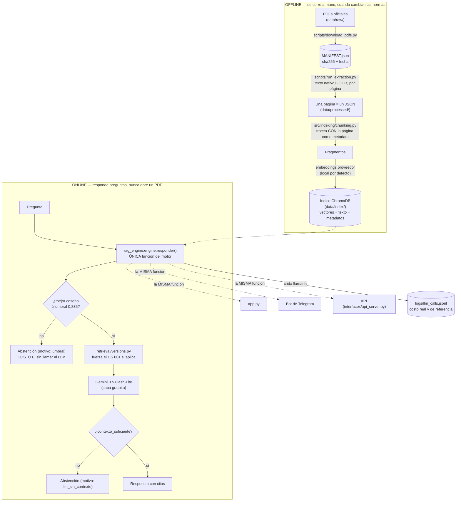

# Tarea 1 — RAG normativo de contrataciones públicas del Perú

[](https://github.com/RenataZuta/Homework/actions/workflows/eval.yml)

Asistente que responde preguntas sobre la **Ley 32069**, su **Reglamento (DS 009-2025-EF, subconjunto con OCR)** y la **modificatoria DS 001-2026-EF**,
citando documento y página, sin inventar información fuera de esos tres documentos. Pensado para el dueño de una micro o pequeña empresa que quiere
saber, en su propio lenguaje, cómo venderle al Estado. Disponible como app web, bot de Telegram y API.
Repositorio: `RenataZuta/Homework`, rama `tarea1-rag`, carpeta `tarea1/`. Issue del curso: d2cml-ai/Data-Science-Python#187.

> **Estado (2026-09-22):** las 13 fases están implementadas y probadas (**717 tests**, `check_secrets.py` limpio, motor sin imports de interfaz). Quedan
> puntos [MANUAL] que solo la persona puede completar: validar el set de evaluación (Fase 3), probar el bot con un token real (Fase 10), desplegar el
> backend y el Worker (Fase 11) y la app pública (Fase 12), y grabar el video. El detalle fase por fase, con evidencia, está en [`PROGRESO.md`](PROGRESO.md).

## Arquitectura: dos procesos que nunca se mezclan



**Por qué la página es metadato desde el primer paso, no texto suelto.** `run_extraction.py` escribe **un archivo JSON por página** (nunca une el
documento en un solo string): la página viaja como campo (`pagina`) en cada fragmento, junto con el documento y la versión de la norma. Si se troceara
después de unir todo, se perdería para siempre qué página originó cada frase — y sin eso no hay citas verificables ni manejo de versiones. Es la
Regla Global 6 del proyecto, y una prueba (`test_el_motor_no_abre_pdfs`) verifica que el motor de consulta jamás toca un PDF.

**Dónde se decide no llamar al LLM (dos puntos, no uno).** (1) La **compuerta del umbral**, ANTES de cualquier llamada: si el mejor coseno recuperado
es menor que `retrieval.umbral_similitud` (0,835, calibrado con el LLM real), se abstiene con costo 0 y sin red — es la primera línea de defensa, la más
barata. (2) El propio **LLM**, con el campo estructurado `contexto_suficiente` en su salida (tool use / JSON con esquema, nunca texto libre a interpretar):
si el contexto recuperado no le alcanza para responder con seguridad, lo declara y el motor abstiene por `motivo_abstencion="llm_sin_contexto"`. La
abstención es siempre el campo `abstuvo: bool`, nunca algo que se infiere leyendo si la respuesta "suena" a "no sé".

## Puesta en marcha en Windows (PowerShell)

> Los pasos se probaron con sus equivalentes en macOS (entorno virtual limpio, instalación desde `requirements.txt`, tests y apertura de la app). **Los comandos de PowerShell no se pudieron
> ejecutar en la máquina de desarrollo** (macOS): si alguno falla, revisa primero rutas y versiones, y avísame.

**Requisitos:** Windows 10/11, **Python 3.12** (`py -3.12 --version`; con Python 3.13+ pueden no existir ruedas de PyTorch o ChromaDB), Git y ~3 GB libres (PyTorch CPU + modelo de embeddings).

```powershell
# 1. Clonar y entrar a la carpeta del proyecto
git clone https://github.com/RenataZuta/Homework.git
cd Homework
git checkout tarea1-rag
cd tarea1

# 2. Entorno virtual con Python 3.12
py -3.12 -m venv .venv
.\.venv\Scripts\Activate.ps1
#   Si PowerShell bloquea el script:  Set-ExecutionPolicy -Scope Process -ExecutionPolicy Bypass
python -m pip install --upgrade pip

# 3. PyTorch SOLO CPU, ANTES del resto (evita bajar la versión con CUDA, ~2 GB)
pip install torch --index-url https://download.pytorch.org/whl/cpu

# 4. Dependencias del proyecto
pip install -r requirements.txt

# 5. Credenciales: copia la plantilla y completa GEMINI_API_KEY (clave gratuita: https://aistudio.google.com/apikey)
Copy-Item .env.example .env
python scripts\set_env_key.py GEMINI_API_KEY      # pide la clave con entrada oculta y la guarda en .env (no la muestra)
python scripts\set_env_key.py --estado            # comprueba qué variables están definidas (nunca muestra valores)
```

### Tesseract (solo si vas a repetir la extracción con OCR)
`data\processed\` ya viene en el repositorio, así que **la app no necesita Tesseract**. Para rehacer el OCR del Reglamento (75 páginas escaneadas):

1. Instala Tesseract 5 para Windows (compilación de UB Mannheim, <https://github.com/UB-Mannheim/tesseract/wiki>) y marca el idioma **Spanish** en el instalador.
2. Comprueba el idioma: `& "C:\Program Files\Tesseract-OCR\tesseract.exe" --list-langs` debe listar `spa`.
3. En `.env` escribe la ruta: `TESSERACT_CMD=C:\Program Files\Tesseract-OCR\tesseract.exe`

### Orden de ejecución
**Ruta rápida (lo mínimo para usar la app):** el índice no se versiona (se regenera), así que se construye una vez. La primera vez descarga el modelo de embeddings (~470 MB).

```powershell
python scripts\build_index.py            # idempotente y reanudable (Ctrl+C es seguro)
streamlit run app.py                      # abre http://localhost:8501; NO reconstruye el índice
```

**Ruta completa (reproducir todo):**

```powershell
$env:PYTHONPATH = "src"                   # para los módulos de src\evaluation (solo en esta sesión)
python scripts\download_pdfs.py           # 1. descarga los PDFs oficiales y escribe data\raw\MANIFEST.json
python scripts\run_extraction.py          # 2. PDF -> una entrada JSON por página (OCR solo en el subconjunto configurado)
python scripts\validate_eval_set.py       # 3. evaluación previa: el set apunta a páginas procesadas
python -m evaluation.select_local_model   #    (opcional) compara modelos de embeddings locales: descarga varios candidatos, ~6 GB
python -m evaluation.compare_chunking     #    (opcional) compara configuraciones de troceado
python scripts\build_index.py             # 4. índice persistente en data\index
python -m evaluation.run_eval             # 5. Recall@k y abstención, sin llamar al LLM (código de salida 1 si Recall@3 < eval.min_recall_at_3)
python -m evaluation.eval_end_to_end --umbral 0   #    evaluación con el LLM real (usa la cuota gratuita; ~27 llamadas)
python -m evaluation.sweep_threshold_e2e  #    umbral a partir de esa evaluación
streamlit run app.py                      # 6. interfaz
```

Los scripts se ejecutan **desde la carpeta `tarea1`**. En Linux/macOS: `source .venv/bin/activate`, `cp .env.example .env` y `PYTHONPATH=src python -m evaluation.run_eval`.

### Pruebas y verificación de la arquitectura
```powershell
pip install pytest
python -m pytest                                          # toda la suite (~30 s, sin red ni claves)
python scripts\check_secrets.py                           # sin claves ni tokens en el árbol ni en el historial de git
# El motor NO importa librerías de interfaz: debe dar 0 coincidencias
Select-String -Path src\rag_engine\*.py,src\rag_engine\*\*.py -Pattern "streamlit|telegram|fastapi|flask|gradio"
```
Equivalente en Linux/CI: `grep -rnE "streamlit|telegram|fastapi|flask|gradio" src/rag_engine` (0 coincidencias).

### La interfaz (`app.py`)
Carga el índice existente **una sola vez** (`@st.cache_resource`) y **nunca lo reconstruye** al iniciar; si falta, muestra un error con el comando para construirlo. Solo llama a `MotorRAG.responder(pregunta)`.
Pestañas: **Consulta** (respuesta, indicador de abstención, avisos de versión, fragmentos citados con documento/página/similitud/texto, y costo, tokens y latencia de la consulta),
**Calidad de extracción**, **Evaluación** (Recall@k, abstención, barrido de umbral, embeddings, troceado, BM25) y **Costos** (agregado de `logs/llm_calls.jsonl`). Los errores salen con `st.error`.

## Resultados (números reales, medidos; provisionales hasta validar el set de la Fase 3)

### Extracción y OCR

| Documento | Versión | Páginas | Con OCR | Fragmentos indexados |
|---|---|---|---|---|
| Ley 32069 | `ley_vigente` (compendio OECE al 19.07.2026) | 63 | 0 | 427 |
| DS 009-2025-EF (Reglamento) | `reglamento_original_2025` | 75 (subconjunto de ~389) | 75 | 1 042 |
| DS 001-2026-EF (modificatoria) | `modificatoria_2026-01` | 16 | 0 | 205 |

Motor de OCR elegido: **Tesseract 5, `spa`, 200 DPI** (ver «Justificación» abajo). Detalle completo, con el subconjunto de páginas y su motivo: [`docs/ocr_subset.md`](docs/ocr_subset.md).

### Troceado (chunking): 6 configuraciones comparadas

| Config. | Tamaño/solape | Contexto de encabezado | Fragmentos | R@1 | R@3 | R@5 | R@3 modificatoria |
|---|---|---|---|---|---|---|---|
| c500_o50 | 500/50 | sí | 2 447 | 0,810 | 0,810 | 0,857 | 0,600 |
| **c750_o100 (activa)** | **750/100** | **sí** | **1 674** | **0,762** | **0,905** | **0,905** | **0,800** |
| c750_o100_sinctx | 750/100 | no | 1 674 | 0,762 | 0,857 | 0,905 | 0,600 |
| c1000_o150 | 1000/150 | sí | 1 260 | 0,714 | 0,810 | 0,857 | 0,800 |
| c1500_o200 | 1500/200 | sí | 800 | 0,810 | 0,810 | 0,857 | 0,800 |
| c1000_o150_sinctx | 1000/150 | no | 1 260 | 0,714 | 0,857 | 0,905 | 0,800 |

`c750_o100` ganó en R@3 (la métrica que más importa: es el `k` que usa la app) y en R@3 de la modificatoria; el contexto de encabezado (heredar el título del artículo de
la página anterior) sube el R@3 de 0,857 a 0,905. Detalle: [`eval/results/chunking_comparacion.md`](eval/results/chunking_comparacion.md).

### Umbral de abstención

| Ítem | Valor |
|---|---|
| Umbral final | **0,835** |
| Calibrado con | La evaluación de punta a punta CON el LLM real (`evaluation/sweep_threshold_e2e.py`), no solo con similitudes |
| Por qué no 0,865 (la primera calibración) | Ese umbral, calibrado solo con similitudes, descartaba 2 respuestas correctas (q01, q08) sin evitar ninguna respuesta indebida de más: con el LLM real como segunda defensa, F-β queda plano hasta 0,840 |
| Con el umbral final (punta a punta, 27 preguntas) | 18/21 del dominio respondidas con cita correcta; 5/6 ajenas rechazadas por el propio LLM; 1 respuesta indebida (`o05`, con información real de la Ley p. 17) |

Detalle: [`eval/results/umbral_e2e_resumen.md`](eval/results/umbral_e2e_resumen.md).

### Embeddings: local frente a API

| Modelo | Estado | Dim | Indexación | Costo real | R@1 | R@3 | R@5 | RAM (medida) |
|---|---|---|---|---|---|---|---|---|
| **`multilingual-e5-small` (local, activo)** | medido | 384 | 51,5 s | **USD 0** | 0,762 | **0,905** | 0,905 | **883 MB** |
| `text-embedding-3-small` (OpenAI) | pendiente (sin `OPENAI_API_KEY`; no se cargó crédito) | 1536 | — | ~USD 0,006 estimado para todo el corpus | — | — | — | — |
| `gemini-embedding-2` (Gemini) | incompleto: 960/1674 fragmentos (cuota gratuita de 1000 textos/día) | 768 | — | USD 0 (capa gratuita) | — | — | — | — |

**Recomendación: el modelo local.** Es el único con Recall medido, cuesta USD 0, no depende de la red ni de una clave, y sus vectores pesan 2,45 MB (384 dim ×
1674 fragmentos) frente a los 1536 de OpenAI. Su costo es memoria (883 MB medidos), no dinero — el trade-off relevante para este proyecto. Detalle y la desviación
del plan original (sin cargar crédito): [`eval/results/embeddings_comparacion.md`](eval/results/embeddings_comparacion.md).

### BM25 frente a semántica y costo por consulta

Ver la sección dedicada más abajo («BM25 frente a búsqueda semántica») para la tabla completa. Resumen de costo real, agregando **las 110 llamadas reales**
hechas durante todo el desarrollo (`logs/llm_calls.jsonl`, Gemini 3.5 Flash-Lite, capa gratuita):

| Ítem | Valor |
|---|---|
| Llamadas reales | 110 (109 exitosas, 1 rechazo por un ID de modelo retirado) |
| Costo REAL | **USD 0** (capa gratuita) |
| Costo de REFERENCIA (si fuera de pago) | USD 0,075933 en total → **USD 0,000697 por consulta** |
| Tokens | 161 726 de entrada, 10 966 de salida |
| Latencia mediana | 1,92 s |

Reporte completo, con desglose por modelo y por día: `eval/results/` (leído en vivo por la pestaña **Costos** de la app) y el checklist de auditoría en `PROGRESO.md`.

## Justificación de las decisiones técnicas principales

**Motor de OCR: Tesseract, no EasyOCR.** Medido en `eval/results/ocr_benchmark.md` sobre las mismas páginas: a 200 DPI, Tesseract reconoció **~620 palabras
correctas por página frente a 276 de EasyOCR**, y es **~6,7 veces más rápido** (4,2-4,6 s/página frente a 28-31 s). Se probaron 96/150/200/300 DPI: 150 DPI da un
% de palabras conocidas ligeramente mayor pero **omite ~20 % del texto** (menos caracteres extraídos en total); 200 DPI es el mejor equilibrio. Solo se aplicó
al **subconjunto de páginas realmente escaneadas** del Reglamento (75 de ~389): las páginas con capa de texto se leen directo con PyMuPDF, sin OCR.

**Vector store: ChromaDB.** Persiste en disco sin servidor, guarda junto a cada vector el texto y los metadatos (documento, versión, página) que hacen falta
para citar, admite `upsert` por ID (la base de la idempotencia del índice) y filtrar por metadatos. FAISS sería más rápido en la búsqueda, pero no guarda texto
ni metadatos por sí solo; con ~1 700 fragmentos la diferencia de velocidad no se nota y FAISS habría costado más código. Un hallazgo real cambió cómo se usa:
su búsqueda aproximada (HNSW) daba resultados **distintos entre procesos** para la misma pregunta (medido: 2 de 3 procesos para `o01`), así que la recuperación
usa **coseno exacto** (`retrieval.busqueda: exacta`) — con ~1 700 vectores cuesta menos de 1 ms y es determinista; Chroma se sigue usando como almacén.

**Modelo de embeddings: `intfloat/multilingual-e5-small`, local.** Comparado contra `multilingual-e5-base`, `paraphrase-multilingual-MiniLM-L12-v2` y `bge-m3`
(`eval/results/modelos_locales.md`): e5-small logra R@3 0,81 con la mejor relación velocidad/calidad (21,9 ms/consulta; e5-base es 3× más lento por poco Recall
extra; bge-m3 es 8× más pesado). Frente a las APIs (OpenAI, Gemini): cuesta USD 0, no depende de una clave ni de la red para responder preguntas, y sus
vectores (384 dim) pesan una fracción de los de OpenAI (1536 dim). Su costo real es memoria: **883 MB medidos** al cargarlo (con PyTorch), el dato que llevó a
elegir Streamlit Community Cloud con una salida de contingencia lista (cambiar a embeddings de Gemini) si la RAM no alcanza en el despliegue público.

**Proveedor de generación: Google Gemini (capa gratuita), no Anthropic.** Decisión posterior de la persona («no pagar nada adicional a mi suscripción»):
Anthropic no ofrece capa gratuita. `gemini-3.5-flash-lite` se eligió tras verificar que `gemini-2.5-flash-lite` (la opción inicial, «estable» según la
documentación) fue rechazado por la API real («ya no disponible para usuarios nuevos») — lección: verificar la disponibilidad de un modelo con una llamada
real, no solo con la documentación. El cliente de Anthropic se conserva en el código, sin usar (`llm.provider: anthropic`, exige `llm.nivel: pago`).

## BM25 frente a búsqueda semántica (Fase 8)

`src/rag_engine/retrieval/` tiene tres modos, elegibles con `retrieval.modo`: `semantico` (embeddings, coseno exacto), `bm25` (léxico, implementado aquí con minúsculas, sin tildes, stopwords y,
opcionalmente, un stemmer ligero de plurales) e `hibrido` (Reciprocal Rank Fusion de ambas listas). Los tres trabajan sobre **los mismos 1674 fragmentos**. Comparación completa, por pregunta y con
la lista de dónde gana cada método: [`eval/results/retrievers_comparacion.md`](eval/results/retrievers_comparacion.md) (`PYTHONPATH=src python -m evaluation.compare_retrievers`).

Set de evaluación (21 preguntas del dominio; **PROVISIONAL** hasta validar el set):

| Variante | R@1 | R@3 | R@5 | MRR | R@3 coloquial | R@3 jurídico | R@3 modificatoria |
|---|---|---|---|---|---|---|---|
| **semántico** | **0,762** | **0,905** | **0,905** | **0,825** | **0,818** | 1,000 | 0,800 |
| BM25 | 0,571 | 0,714 | 0,762 | 0,647 | 0,455 | 1,000 | 0,800 |
| BM25 + stemming | 0,619 | 0,762 | 0,810 | 0,694 | 0,545 | 1,000 | 0,800 |
| híbrido (RRF) | 0,714 | 0,810 | 0,810 | 0,754 | 0,636 | 1,000 | 0,800 |
| híbrido (RRF) + stemming | 0,714 | 0,905 | 0,905 | 0,802 | 0,818 | 1,000 | 0,800 |

Sonda sintética de **números de artículo** (96 consultas «artículo N de la Ley», generadas a partir del propio índice; no es parte del set porque el set no tiene ninguna pregunta con cifras):

| Variante | R@1 | R@3 | R@5 |
|---|---|---|---|
| semántico | 0,271 | 0,448 | 0,542 |
| **BM25** (con encabezado) | **0,521** | **0,844** | **0,938** |
| BM25 sin encabezado | 0,302 | 0,698 | 0,833 |
| híbrido (RRF) | 0,500 | 0,771 | 0,823 |

**Qué gana en las preguntas coloquiales, y por qué.** Gana el **semántico** (R@3 0,818 frente a 0,455 de BM25, 0,545 con stemming). La persona que pregunta no usa el vocabulario de la ley: «¿Puedo venderle al Estado si mi empresa
recién abrió?» (q01), «si la entidad se demora en pagarme…» (q02) o «cuánto me pueden cobrar por cada día que entrego tarde» (q10) hablan de *proveedor*, *inscripción*, *intereses legales* y *penalidad por mora* con otras palabras.
BM25 solo puntúa términos compartidos con el fragmento, así que no encuentra en el top-3 ninguna de las cinco preguntas que el semántico acierta y BM25 no (q01, q02, q03, q09, q10); el embedding sí relaciona significados. En las
preguntas de estilo jurídico ambos aciertan todo (R@3 1,000): el vocabulario ya coincide.

**Dónde acierta BM25.** (1) En la **búsqueda por número de artículo** y términos exactos: en la sonda, R@3 0,844 frente a 0,448 del semántico, porque «114» o «artículo 66» son términos exactos y los embeddings casi no
distinguen cifras; indexar el encabezado («Artículo 66. Adelantos») pesa mucho (sin él, 0,698). (2) En **q07** («ofertas con el **mismo puntaje**»): BM25 pone el fragmento correcto en el puesto 1 y el semántico en el 166, porque
la regla de desempate usa literalmente «puntaje» mientras que la pregunta coloquial se parece más a otros fragmentos sobre puntajes. q04 («hasta qué monto me pueden comprar sin hacer una licitación», que la ley llama *contratos
menores*) falla en ambos (puestos 51 y 58): es la brecha de vocabulario que ninguno cierra.

**Híbrido.** Con RRF y stemming iguala al semántico en R@3 y R@5 del set (0,905) pero con menor R@1 y MRR, y mejora mucho la búsqueda por número de artículo (R@3 0,771). **No recupera q07** aunque BM25 la tenga primera, porque RRF solo mira posiciones
y el fragmento está fuera de los primeros 50 del semántico. No es un problema de ajuste: con 100 o 200 candidatos y `rrf_k` 10 o 60 el resultado del set no cambia (q04 y q07 siguen fallando).

**Decisión: `retrieval.modo: semantico`.** Es el mejor en R@1, R@3, R@5 y MRR sobre el set, y también de punta a punta con el LLM real (evaluación con umbral 0, una corrida de cada modo): **semántico 18/21 respondidas con cita correcta y 1
respuesta indebida; híbrido con stemming 17/21 y 2 indebidas** (`eval/results/e2e_hibrido_stem_umbral_0.000.md`). Con 21 preguntas y una sola corrida de un LLM con temperatura por defecto, una pregunta de diferencia no es concluyente; lo que sí
es claro es que el híbrido **no mejora** el set. Si el uso esperado incluye muchas consultas por número de artículo, `retrieval.modo: hibrido` con `retrieval.bm25.stemming: true` es la opción respaldada por la sonda
(`python -m evaluation.compare_retrievers --aplicar hibrido_rrf_stem`).

**Umbral de abstención con BM25 o híbrido.** Los puntajes de BM25 y de RRF **no son cosenos**, así que el umbral **nunca** se compara con ellos: cada fragmento devuelto conserva su **coseno exacto** con la consulta (`similitud`) y la compuerta del
motor abstiene según el **mayor coseno entre los recuperados**, sea cual sea el modo que ordenó. Por eso el umbral calibrado (0,835) sigue significando lo mismo en los tres modos (tests: la compuerta compara cosenos, no
puntajes; sin coincidencias léxicas BM25 devuelve vacío y el motor se abstiene sin llamar al LLM).

## Recuperación exacta

`retrieval.busqueda: exacta` calcula el coseno contra todos los vectores del índice (menos de 1 ms con ~1 700 fragmentos). La búsqueda aproximada HNSW de Chroma daba resultados
distintos entre ejecuciones en este corpus (para la pregunta `o01`, 2 de 3 procesos), lo que hacía irreproducibles las respuestas; la exacta es determinista y el Recall no cambia.

## Integración continua: compuerta de Recall@3 (Fase 9)

`.github/workflows/eval.yml` corre en cada push y pull request que toque `tarea1/`: instala Python 3.12 con caché de pip, **PyTorch solo CPU** desde el índice oficial de CPU y las dependencias livianas
(`requirements-ci.txt`), cachea el modelo de embeddings, ejecuta las pruebas, **arma el índice a partir de `data/processed/`** (el OCR **no** corre en CI: el texto procesado está versionado) y ejecuta
`python -m evaluation.run_eval`, que **falla (código 1) si Recall@3 < `eval.min_recall_at_3`** de `config.yaml`. Sube `eval/results/` como artefacto aunque falle. **No requiere ningún secreto**: no llama a ningún LLM ni a ninguna API
(hay una prueba que lo verifica).

**Por qué 0,85.** El Recall@3 real es 0,905 (19 de 21 preguntas). Con 21 preguntas cada una pesa 0,048: un mínimo de 0,85 exige 18 de 21, es decir, **tolera una pregunta más fallida** (17/21 = 0,810 falla, 18/21 = 0,857 pasa) y detecta
regresiones reales del troceado, del modelo o del índice sin dar falsas alarmas por una diferencia numérica mínima entre entornos. Es provisional hasta validar el set (Fase 3). Cambiarlo es editar una línea de `config.yaml`.

Se probó localmente en un clon limpio con un entorno virtual nuevo, sin `.env`, Tesseract ni Streamlit (717 pruebas, `build_index`, `run_eval` en verde: ver «Auditoría final» en `PROGRESO.md`).

**Corrida verde en `tarea1-rag`:** [run 35677918111](https://github.com/RenataZuta/Homework/actions/runs/35677918111). **Corrida roja demostrada** (rama `demo-ci-rojo`, `min_recall_at_3` subido a propósito a 0,99, por encima del 0,905 real): [run 35730766798](https://github.com/RenataZuta/Homework/actions/runs/35730766798); el valor correcto (0,85) nunca se tocó en `tarea1-rag`.

## Bot 24/7 con Cloudflare Worker + backend (Fase 11)

Un Worker de Cloudflare **no puede** ejecutar el motor: su runtime no corre `sentence-transformers` (necesita PyTorch) ni ChromaDB.
Por eso hay dos piezas, no una:

```mermaid
flowchart LR
    T[Usuario en Telegram] --> W["Worker de Cloudflare<br/>(cloudflare_worker/)<br/>valida el secreto, responde 200<br/>de inmediato, reenvía con ctx.waitUntil"]
    W -- "X-Internal-Key" --> B["Backend FastAPI<br/>(interfaces/api_server.py)<br/>SIEMPRE encendido: tiene el motor"]
    B -- responder&#40;pregunta&#41; --> M[rag_engine.engine]
    B -- sendMessage --> T
    W -. "si el backend tarda<br/>(arranque en frío)" .-> T
```



- **Worker** (`cloudflare_worker/`): valida `X-Telegram-Bot-Api-Secret-Token`, responde `200` a Telegram de inmediato (para que no
  reintente) y reenvía el update al backend con `ctx.waitUntil(...)`. Si el backend no contesta a tiempo (el plan gratuito de
  Render duerme tras 15 min sin tráfico y tarda en despertar), el propio Worker le avisa al usuario y reintenta una vez más.
- **Backend** (`interfaces/api_server.py`, FastAPI): `GET /health` sin autenticación; `POST /telegram/webhook` exige la cabecera
  `X-Internal-Key` (un secreto que solo conocen el Worker y el backend — **no** es el token de Telegram) y procesa el update
  con los mismos `interfaces/telegram_handlers` de la Fase 10, en segundo plano.
- **Host elegido: Render, plan gratuito.** Verificado el 2026-09-22: sin tarjeta, admite Docker, dan 750 horas gratis al mes.
  Duerme tras 15 min sin tráfico y tarda ~1 minuto en despertar (documentado oficialmente); el Worker está pensado para ese
  arranque en frío, no para evitarlo. **Se descartó Hugging Face Spaces con Docker**: su documentación oficial dice ahora que
  crear un Space Docker en una cuenta personal **requiere el plan PRO de pago** (antes era gratis); Google Cloud Run se
  descartó porque exige asociar una tarjeta a una cuenta de facturación. **Riesgo sin confirmar:** no encontré con una fuente
  oficial la RAM exacta del plan gratuito de Render; si el modelo + el índice no caben, hay que achicar la imagen o cambiar de host.
- **El índice y el modelo se preparan en el `Dockerfile` durante el `build`, nunca al arrancar** (`RUN` descarga el modelo y
  construye el índice a partir de `data/processed/`, que sí está en git; `data/index/` no lo está, igual que en el CI de la
  Fase 9). `requirements-backend.txt` es más chico que `requirements.txt`: sin OCR, sin gráficos, sin el cliente de Anthropic.
- **Desviación del plan original:** el Worker usa un 4.º secreto, `TELEGRAM_BOT_TOKEN` (el plan solo mencionaba
  `TELEGRAM_WEBHOOK_SECRET`, `BACKEND_URL` y `BACKEND_INTERNAL_KEY`). Sin él, el Worker no podría enviar el aviso de «me estoy
  despertando» cuando el backend tarda: esa llamada a Telegram la hace directamente el propio Worker.
- **No se pudo probar de punta a punta ni ejecutar `docker build`/`wrangler deploy`**: esta máquina de desarrollo no tiene
  `docker`, `node` ni `wrangler` instalados. El código se revisó con pruebas estáticas (`tests/test_cloudflare_worker.py`, que
  lee el `Dockerfile` y el Worker como texto) y con `interfaces/api_server.py` probado de verdad (`fastapi.testclient`,
  711 pruebas en total). Los pasos [MANUAL] de cuentas y despliegue están en `docs/despliegue_backend.md`.

## Despliegue público de la app (Fase 12)

**Estado: código y pruebas listos; el despliegue real es un paso [MANUAL], ver `docs/despliegue_app_publica.md`.** Cuando la
persona lo haga, el enlace público queda aquí.

- **Plataforma: Streamlit Community Cloud** (gratis, sin tarjeta). Se descartó Hugging Face Spaces por el mismo motivo que en
  la Fase 11 (ahora exige plan PRO para Spaces con cómputo en cuenta personal).
- **Memoria medida en local (dato real):** cargar el modelo de embeddings local ya usa **883 MB** de RSS, antes de sumar el
  propio servidor de Streamlit. La cifra que más se cita para el límite gratuito de Streamlit Cloud es 1 GB (sin confirmación
  oficial textual hoy): es un riesgo real. La salida ya está lista y probada: cambiar `embeddings.proveedor: gemini` en
  `config.yaml` quita PyTorch y el modelo local por completo.
- **El índice va en el repositorio** (`data/index/`, 11 MB): la app pública no tiene un paso de "build" propio, así que
  nunca puede reconstruirlo al iniciar sesión (regla no negociable de la fase).
- **Protección de costo (la app usa la clave de la persona):** `deploy.topes.consultas_por_sesion` y
  `deploy.topes.consultas_globales_por_dia` en `config.yaml`. Se revisan ANTES de llamar al motor (cero costo si ya se
  alcanzaron); el tope de sesión usa el estado de la sesión de Streamlit, el global lee `logs/llm_calls.jsonl` de hoy (en
  `deploy.zona_horaria`) — sin base de datos nueva. Solo cuentan las llamadas que de verdad llegaron al LLM: una abstención
  por umbral no gasta cupo.
- La clave (`GEMINI_API_KEY`) va en los *Secrets* de Streamlit Cloud, nunca en el repositorio.

## Proveedores y costo (decisión del 2026-09-21: sin pagos adicionales)

| Etapa | Proveedor activo | Costo real | Cómo cambiarlo |
|---|---|---|---|
| Generación (LLM) | **Google Gemini `gemini-3.5-flash-lite`, capa gratuita** | **USD 0** | `llm.provider` y `llm.proveedores.*` en `config.yaml` |
| Embeddings del índice | **Local** `intfloat/multilingual-e5-small` (CPU) | USD 0 | `embeddings.proveedor` |
| Comparación de embeddings por API | OpenAI `text-embedding-3-small` y Gemini `gemini-embedding-2` | ver más abajo | `embeddings.comparar` |

El cliente de **Anthropic se conserva pero no se usa** (`llm.provider: anthropic` exigiría `llm.nivel: pago`; la configuración lo valida).

### Costo real y costo de referencia
Cada llamada al LLM se registra en `logs/llm_calls.jsonl` con **`costo_usd_real`** (lo que se cobra: 0 en la capa gratuita) y **`costo_usd_referencia`**
(lo que costaría con el precio de **pago** del modelo, de `pricing.yaml`, con fuente y fecha de verificación). Sirve para dimensionar el gasto si algún
día se pasara a un plan de pago. Los precios se conservan por **ventanas horarias** (`pricing.yaml`, `llm/pricing.py`): hoy Google publica un único precio por modelo,
y la estructura está probada con una tabla ficticia de horas pico y valle. Las respuestas que salen de la caché de la evaluación **no** son llamadas y no se registran.

### Conseguir y guardar la clave (gratis, sin tarjeta)
1. Crea una clave en **Google AI Studio**: <https://aistudio.google.com/apikey>.
2. Guárdala **sin mostrarla** (pide el valor con entrada oculta y escribe `tarea1/.env`, que git ignora):
   ```
   python scripts/set_env_key.py GEMINI_API_KEY
   python scripts/set_env_key.py --estado        # qué variables están definidas (nunca muestra valores)
   ```
Nunca pegues una clave en el chat, en `config.yaml` ni en el repositorio. Si se filtra, revócala en AI Studio y crea otra.

## Límites de uso: throttle, reintentos y cuota

La capa gratuita tiene límites por proyecto (RPM, TPM, RPD). Los números **no figuran en la documentación pública**: se consultan en
<https://aistudio.google.com/rate-limit>. El proyecto los respeta así (`llm.limites` y `embeddings.limites` en `config.yaml`):

- **Throttle por RPM** (`rpm`): ventana deslizante de 60 s; nunca envía más de `rpm` peticiones por minuto. El valor por defecto (10 para el LLM, 20 para embeddings) es un
  **valor de diseño conservador, no el límite de Google**: ajústalo a lo que muestre tu AI Studio.
- **Reintentos con backoff exponencial** ante 429 por tasa, 5xx y errores de red: esperas de 4, 8, 16, 32 s (tope 60 s) con jitter, respetando el `retryDelay` que sugiera Google.
  **No** se reintentan clave inválida, formato malformado, bloqueo de contenido ni la **cuota diaria** agotada (esperar segundos no sirve).
- **Cuota agotada = error estructurado.** Si el límite persiste tras los reintentos, o se agota la cuota diaria, `responder()` devuelve `respuesta=None`, `error` con
  el mensaje y `error_tipo="cuota_agotada"`. **Nunca** una respuesta normal ni una abstención disfrazada. La interfaz muestra `mensajes.error_cuota`.
- **Caché de la evaluación de punta a punta** (`eval.cache_llm`, carpeta `eval/cache_llm/`, ignorada por git): la clave es el hash de proveedor, modelo, temperatura, `max_tokens`,
  prompt de sistema, prompt de usuario (pregunta + fragmentos) y esquema. Repetir la evaluación no repite llamadas ni gasta cuota; si cambia cualquiera de esos elementos, se llama de nuevo.
  Si la cuota se agota a mitad de la evaluación, se corta con un informe «EVALUACIÓN INCOMPLETA», y al repetirla continúa donde quedó. `--sin-cache` fuerza llamadas reales.

## Privacidad

> **En la capa gratuita, Google puede usar el contenido enviado para mejorar sus productos.** La página oficial de precios lo indica en la fila
> «Used to improve our products» (Sí en el nivel gratuito, No en el de pago; verificado el 2026-09-21: <https://ai.google.dev/gemini-api/docs/pricing>).

Por eso el motor **solo envía al proveedor la pregunta y fragmentos de normas públicas** (Ley, Reglamento y modificatoria, publicados oficialmente), dentro de las plantillas de
`config.yaml` (`prompts.sistema` y `prompts.usuario`). No envía claves, variables de entorno, rutas locales ni datos de otros usuarios; hay un test que lo verifica
(`test_al_proveedor_solo_llegan_la_pregunta_y_fragmentos_de_normas`). Aun así:

- **No escribas datos personales ni información confidencial en las preguntas**; la aplicación muestra este aviso (`mensajes.aviso_privacidad`).
- Si necesitas privacidad total, usa el nivel de pago (`llm.nivel: pago`, en el que Google indica que no usa el contenido para mejorar sus productos) o un proveedor local.
- Los embeddings del índice se calculan **localmente**: el texto de las normas y las preguntas no salen de tu máquina para la recuperación. Solo la generación, y la comparación
  opcional de embeddings por API (que envía fragmentos de normas públicas), usan la red.

## Embeddings por API: desviación respecto al plan original

El plan comparaba el modelo local con `text-embedding-3-small` de OpenAI. Como **no se cargará crédito**, se aplicó esta regla (`evaluation/compare_embeddings.py`):

1. Se intenta OpenAI **sin cargar crédito**. Si la API responde `insufficient_quota` (cuenta sin saldo), la fila queda **«no ejecutada por costo»**, sin cifras inventadas.
   Sin `OPENAI_API_KEY`, la fila queda «pendiente».
2. Como segunda implementación por API se agregó **`gemini-embedding-2`** (capa gratuita «Free of charge», verificado el 2026-09-21; el preview `gemini-embedding-2-preview` se retiró el 2026-08-10),
   de 768 dimensiones (la guía recomienda 768, 1536 o 3072). Este modelo no usa `task_type`: la tarea va en el texto con las plantillas de la guía oficial
   (`task: search result | query: …` y `title: none | text: …`, en `config.yaml`).
3. **Cuota gratuita: 1000 textos por día y por modelo** (cada texto cuenta; medido en la respuesta 429 de Google). El corpus tiene 1674 fragmentos, así que la fila de Gemini se
   completa en **dos días**: `compare_embeddings.py` conserva el índice de los modelos por API y **reanuda** donde quedó al volver a ejecutarlo.
4. Su respuesta **no informa tokens**, así que la fila lo declara («no informado por la API») en vez de estimar un costo.

Resultados: [`eval/results/embeddings_comparacion.md`](eval/results/embeddings_comparacion.md). Todo dato provisional se marca hasta validar el set de evaluación (Fase 3).

## Limitaciones (honestas, con evidencia en `PROGRESO.md`)

- **El set de evaluación no está validado por la persona (Fase 3).** Todo Recall, abstención y umbral de este README lleva la marca PROVISIONAL en los
  reportes hasta que se confirme cada `paginas_esperadas` contra el PDF (`docs/eval_revision_manual.md`).
- **21 preguntas del dominio: una sola pregunta pesa 4,8 puntos de Recall.** Las comparaciones (chunking, embeddings, BM25) son orientativas, no concluyentes
  con un margen de un caso.
- **Vocabulario coloquial que ningún método cierra:** `q04` («cuánto me pueden comprar sin licitar», que la ley llama *contratos menores*) y `q07`
  («ofertas con el mismo puntaje») fallan tanto en semántica como en BM25/híbrido.
- **`o05` (fuera de dominio) recibe una respuesta parcial y fundamentada**, no una alucinación: la Ley p. 17 y el Reglamento p. 97 sí hablan de lo que
  pregunta. Es señal de que el etiquetado del set, no el sistema, puede estar mal en ese caso — a revisar en la Fase 3.
- **La cuota gratuita de embeddings de Gemini (1000 textos/día) no alcanzó para completar la comparación** en dos intentos en días distintos: sigue en
  960/1674 fragmentos. `text-embedding-3-small` de OpenAI quedó sin probar (no se cargó crédito, por decisión de la persona).
- **El Dockerfile y el Worker de Cloudflare nunca se compilaron ni se ejecutaron**: esta máquina de desarrollo no tiene `docker`, `node` ni `wrangler`. Se
  revisaron con pruebas que leen los archivos como texto, no con una build real.
- **Los pasos de Windows/PowerShell no se probaron en Windows** (la máquina de desarrollo es macOS): se verificó el equivalente completo en macOS (venv
  limpio, `pip install`, 717 tests, `run_eval`, la app abriendo) y se tradujeron los comandos, pero no hay una ejecución real en PowerShell.
- **No se confirmó con una fuente oficial la RAM exacta** de los planes gratuitos de Render (Fase 11) ni de Streamlit Community Cloud (Fase 12); ambas
  decisiones se tomaron con el resto de la evidencia disponible y una salida de contingencia ya lista si la memoria no alcanza.
- **Fases 10, 11 y 12 no se probaron con servicios reales** (bot de Telegram, backend desplegado, Worker, app pública): son puntos [MANUAL] que dependen
  de que la persona cree cuentas y cargue secretos, algo que este asistente no puede ni debe hacer por ella.

## Enlaces

- **App pública:** pendiente de despliegue [MANUAL] — ver [`docs/despliegue_app_publica.md`](docs/despliegue_app_publica.md). Se agrega aquí en cuanto exista.
- **Bot de Telegram:** pendiente de probarse con un token real — ver [`docs/telegram_bot.md`](docs/telegram_bot.md).
- **Backend 24/7 + Worker:** pendiente de desplegarse — ver [`docs/despliegue_backend.md`](docs/despliegue_backend.md).
- **Video:** pendiente de grabarse — guion y números reales en [`docs/notas_video.md`](docs/notas_video.md).
